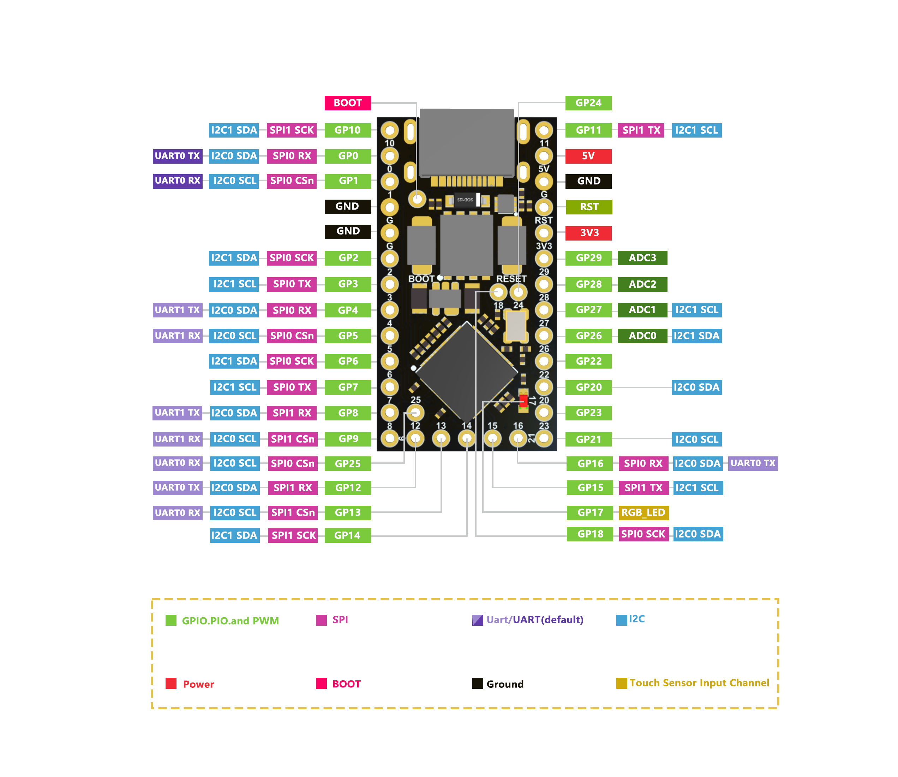
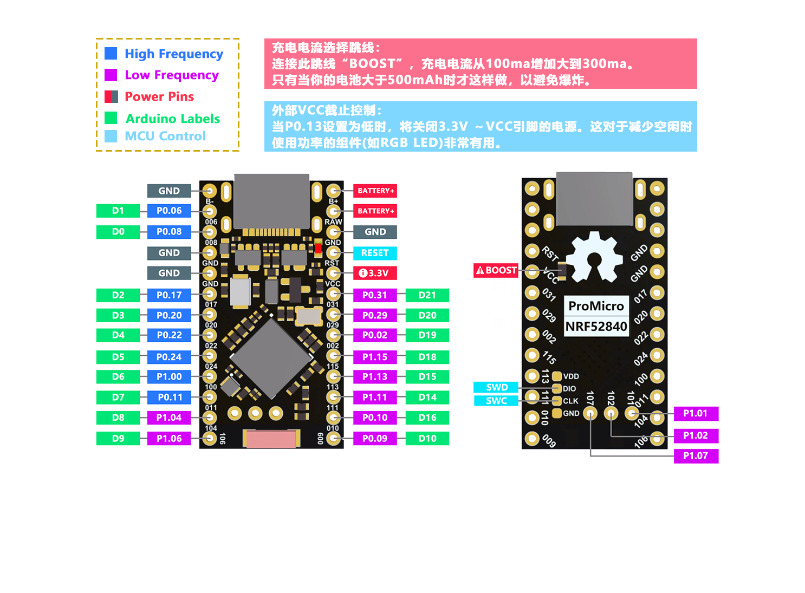

# ZMK Firmware初始化環境教學

## 前言

`zmk firmware` 是客製化鍵盤圈裡最爲人熟知的無線鍵盤韌體，但一直缺少「完整」、「乾淨」的環境建制流程。爲此，我個人在初入 `zmk` 的當下，就決定要邊「執行」環境建制、然後順手寫入這個「手把手」的操作教學。

我個人非屬於韌體、硬體、電路設計等業界三大工程領域的專家，因此在接觸這種硬核的電子專案時，一定也得按照官方的操作教學，加上自己手把手除錯的嘗試，一步步將執行 SOP 建立起來，這才是屬於我的「開源精神」。

當然，我也會盡力讓教學寫得夠白話、夠詳細，希望本教學文本能將我熟知的「三大領域」完美融會貫通，一字不漏地交給在觀看文本的你，減少一些你對「開源客製化鍵盤」的一些失望、失落感。

——在點亮自己鍵盤的那一刻，那種興奮感是無與倫比的。

<br>

## 關於本教學

本教學文本適用「以下」對象：
1. 完全初學者、新手小白。
2. 按照網路上其他操作教學導致電腦異常者。
3. 按照網路上其他操作教學，成功建立個人化環境，然後找不到出錯問題怎麼解決者。
4. 三大專業領域工程師。

本教學的操作環境：`Ubuntu`、`Mint`。
本教學附屬在 `Vanguard-Keyboard-Outsider` 專案底下，因此會借用到屬於該鍵盤的設計檔案——`outsider.pdf`

<br>

## qmk 及 zmk 的差異

`zmk` 的架構跟 `qmk` 完全不一樣——`qmk` 走的是「全域資料輪詢機制」，`zmk` 走的是「樹狀資料封裝發送機制」，這裡我們必須要瞭解一下不同點：
1. `qmk` 的鍵盤主控「`MCU`」會定時、按照順序向「硬體」敲門，詢問有沒有人被按下或執行。同時，你的「`Host端`」也會定時向 `MCU` 敲門索取資料。
2. `zmk` 韌體是藉由 `Zephyr RTOS` 這個工業級的即時作業系統，來將你在單一鍵盤上的操作封裝成資料發送給「`Host端`」，因此就算是分離式鍵盤，也會被視爲「單一裝置」，跟你的「藍牙耳機」連線屬於相同的道理。

> 這裡說明的「`Host端`」，通常指的是「連線或連接」要來「操作或控制」的裝置。

`Master`、`Slave`——也就是裝置的「主」、「從」關係，`qmk` 的部分可以自由選擇定義「左」或「右」；`zmk`的話預設通常都是以「哪一端透過藍牙連上電腦」做爲 `Master`。

這樣方便大家理解一下邏輯，你也會比較容易看得懂 `zmk` 官方文本的內容在寫什麼。


## 教學開始

### A. 創建本地端 zmk 星系

1. 首先你需要準備好你的 GitHub 帳號，將官方的個人化設定檔 `fork` 到你的專案目錄底下（比如：`XXX-zmk-config`）
——https://github.com/zmkfirmware/unified-zmk-config-template
2. 然後操作終端機，定位到你預設的本地 GitHub 倉庫目錄，執行 `zmk` 的安裝流程：https://zmk.dev/docs/user-setup
3. 執行安裝流程到 `zmk init` 的時候，將 `Repository URL` 輸入你方才建立的 `XXX-zmk-config` 的 GitHub 個人化設定檔 `repo` 網址，系統會幫你設定好 `config` 目錄
4. 接著你可以選擇輸入 `Y` 取用現成的 `zmk firmware` 設定檔爲自己網購買來的鍵盤變更 `keymap` 按鍵配置。
5. 選用 `N` 的話，終端機執行 `zmk cd`，定位在預設的 `config` 資料夾目錄。

執行到這裡，我們就已經架設好「本地端」的 `zmk` 星系環境了，接下來我會讓你瞭解 `zmk` 的宇宙架構，請繼續往下看。

<br>

### B. 行星誕生

前述我們將 `zmk` 的星系開拓完畢後，這個星系現在非常地乾淨，什麼都沒有，我們需要在這個星系裡誕生新的「行星」，這也對應著上述 `A-4` 、 `A-5` 點的操作方法：
- 現成的 `zmk` 宇宙設定，雲端導入到你的電腦（星系）進行配置修改。
- 從 `0` 開始創建一個「新的鍵盤」（在星系裡創建行星）。

這裡我不討論導入雲端設定的部分，著重點在於「新的鍵盤」；留意當前的環境是不是：`zmk cd` 或是 `config` 目錄。

<br>

1. 接著在目錄底下執行：

``` markdown
cd boards/shields
mkdir <custom_keyboard>
touch Kconfig.shield <custom_keyboard>.overlay <custom_keyboard>.keymap
```

先創建「行星（`dir`）」、「旗標（`Kconfig`）」、「運作核心（`.overlay`）」、「功能核心（`.keymap`）」檔。

2. 然後將 `Kconfig.shield` 打開，寫入代碼後存檔：

``` markdown
config SHIELD_CUSTOM_KEYBOARD
    def_bool $(shields_list_contains,<custom_keyboard>)
```

寫入這串代碼的用意在：你要告訴你的 `zmk` 宇宙環境下，誕生了這把 `custom_keyboard` 鍵盤。

> 光是創建檔案沒有用，你的 `Kconfig.shield` 檔案裡沒有東西，你要怎麼告訴宇宙「這把鍵盤」存在在這裡呢？

<br>

### C. 運作核心及功能設置

設定好鍵盤的「旗標」，接著才會依序創建「運作核心」及「功能核心」，也就是要先定義好你的鍵盤是使用什麼方式驅動 `zmk` 韌體，後續才會將鍵盤的功能一步步建立起來。

目前應該不用特別說明驅動方式，也就 2 種：
- 開發板驅動（例如：`PICO-W` 或 `SEED XIAO-BLE` 系列）。
- `MOB` 驅動（`MCU on board`）。

這裡我會介紹常用的開發板驅動，也就是 `NRF52840` 晶片的開發板（含 `nice nano v2`）做範例介紹，首先我們需要準備幾樣東西：
1. 開發板本體。
2. 開發板規格書及腳位定義表。
3. 鍵盤電路板原理圖（`PDF` 檔案或設計圖 ）。
4. 實際鍵盤矩陣圖（`KLE` 或設計圖）。

<br>

#### 開發板本體、規格書及腳位定義表

<table>
  <tr>
    <td width="50%">
      
    </td>
    <td width="50%">
      
    </td>
  </tr>
</table>

標準使用 `ProMicro` 腳位的開發板，假設要開發無線有線共用的電路板（`PCB`）的話，那麼一定會用到這個腳位圖，這裡是這兩張圖最常用到的幾個功能：
- 對照正面、背面的 `GPIO` 分佈。
- 全域對照各個 `GPIO` 有什麼功能。

> 特別注意「電壓（`VCC`）」跟「接地（`GND`）」的位置及大小值，這個在電路設計裡面相當重要，用錯設計方法，可是會損壞你的開發板跟電路板的。

> `nice nano v2` 跟 `clones` 的差異最大體現在「`VCC`」的大小，我記得沒錯的話，早期的 `nice nano` 開發板 `VCC` 輸出是 `4.3V`，不是 `3V3`。

電路設計裡面幾個很簡單的概念讓大家知道一下：
- 輸出電壓不對就會罷工，或是燒掉。
- 線沒接對就會罷工，或是燒掉。

> 不正確 = 罷工 or 燒掉。

就是這麼簡單。

<br>

雖然這裡我們不討論 `RP2040 ProMicro` 開發板，但還是要跟大家說明一下「爲什麼」我要放有線鍵盤的開發板出來？
1. 你要知道 `VCC` 、 `GND` 的實際物理位置及電壓值。
2. 相同的 `I2C` 通訊頻道位在哪一個 `GPIO` 上，比如 `I2C0` `SDA`/`SCL` 的位置在 `GP0-1` 上。
3. 同上，`SPI` 通訊腳位位於哪一些 `GPIO` 上，走 `SPI` 頻道可是會花上更多的 `GPIO` 來處理通訊資料。

> 你要拿著有線開發板的 `GPIO` 腳位去對照 `NRF52840 ProMicro` 開發板的腳位是不是有功能的「交集」，然後把該腳位優先提取出來做佈線設計。

`NRF52840 ProMicro` 及 `nice nano v2` 的腳位及功能都是採用相同的設計方式（使用元件不同）：
- 輸出電壓 `3V3`，`GND` 位置跟 `RP2040 ProMicro` 一樣。

> 非常重要：全功能腳位都能輸出 `I2C` 通訊。

> 非常重要：`RAW` 爲電池「正極」的接口。

<br>

#### 電路板原理圖及實際矩陣圖


2. 假設個人化配置的鍵盤使用的是 `NRF52840` 系列的晶片開發板（含 `nice nano v2`），那麼可以將下面這組模板放入鍵盤功能核心檔 `<custom_keyboard>.overlay` 內（一體式鍵盤），然後根據你的鍵盤原理圖，去修改實際對接開發板的腳位。

``` markdown
#include <dt-bindings/zmk/matrix_transform.h>

/ {
    chosen {
        zmk,kscan = &kscan0;
        zmk,matrix_transform = &default_transform;
    };

    kscan0: kscan_0 {
        compatible = "zmk,kscan-gpio-matrix";
        label = "KSCAN";
        diode-direction = "col2row"; /* 根據鍵盤的二極體方向設置 */

        /* 矩陣 Columns 腳位設定 */
        col-gpios
            = <&pro_micro 10 GPIO_ACTIVE_HIGH> /* col0: PB6 */
            , <&pro_micro 16 GPIO_ACTIVE_HIGH> /* col1: PB2 */
            , <&pro_micro 14 GPIO_ACTIVE_HIGH> /* col2: PB3 */
            , <&pro_micro 15 GPIO_ACTIVE_HIGH> /* col3: PB1 */
            , <&pro_micro 18 GPIO_ACTIVE_HIGH> /* col4: PF7 (A0) */
            , <&pro_micro 19 GPIO_ACTIVE_HIGH> /* col5: PF6 (A1) */
            , <&pro_micro 20 GPIO_ACTIVE_HIGH> /* col6: PF5 (A2) */
            , <&pro_micro 21 GPIO_ACTIVE_HIGH> /* col7: PF4 (A3) */
            ;

        /* 矩陣 Rows 腳位設定 */
        row-gpios
            = <&pro_micro 9 (GPIO_ACTIVE_HIGH | GPIO_PULL_DOWN)> /* row0: PB5 */
            , <&pro_micro 7 (GPIO_ACTIVE_HIGH | GPIO_PULL_DOWN)> /* row1: PE6 */
            , <&pro_micro 4 (GPIO_ACTIVE_HIGH | GPIO_PULL_DOWN)> /* row2: PD4 */
            , <&pro_micro 1 (GPIO_ACTIVE_HIGH | GPIO_PULL_DOWN)> /* row3: PD2 */
            , <&pro_micro 8 (GPIO_ACTIVE_HIGH | GPIO_PULL_DOWN)> /* row4: PB4 */
            , <&pro_micro 6 (GPIO_ACTIVE_HIGH | GPIO_PULL_DOWN)> /* row5: PD7 */
            , <&pro_micro 5 (GPIO_ACTIVE_HIGH | GPIO_PULL_DOWN)> /* row6: PC6 */
            , <&pro_micro 0 (GPIO_ACTIVE_HIGH | GPIO_PULL_DOWN)> /* row7: PD3 */
            ;
    };

    /* Keymap 設定 */
    default_transform: keymap_transform_0 {
        compatible = "zmk,matrix-transform";
        /* 矩陣大小設定 */
        columns = <8>;
        rows = <8>;
        map = <
            /* Keymap 按鍵配置會在這裡進行設定 */
            RC(0,0) RC(4,0) RC(0,1) RC(4,1) RC(0,2) RC(4,2) RC(0,3) RC(4,3) RC(0,4) RC(4,4) RC(0,5) RC(4,5)
            RC(1,0) RC(5,0) RC(1,1) RC(5,1) RC(1,2) RC(5,2) RC(1,3) RC(5,3) RC(1,4) RC(5,4) RC(1,5) RC(5,5)
            RC(2,0) RC(6,0) RC(2,1) RC(6,1) RC(2,2) RC(6,2) RC(2,3) RC(6,3) RC(2,4) RC(6,4) RC(2,5) RC(6,5)
            RC(3,0) RC(7,0) RC(3,1) RC(7,1) RC(3,2) RC(7,2) RC(3,3) RC(7,3) RC(3,4) RC(7,4) RC(3,5) RC(7,5) RC(7,7)
        >;
        /* RC()格式說明：R = Row; C = Col; 合併代碼 = RC(A, B) */
    };
};
```

3. Keymap 按鍵配置的部分，首先需要打開 Keyboard Layout Editor（簡稱 KLE），先進行一次實體按鍵的矩陣配置。