# ZMK Firmware 初始化環境教學

## 前言

`zmk firmware` 是客製化鍵盤圈裡最爲人熟知的無線鍵盤韌體，但一直缺少「完整」、「乾淨」的環境建制流程。爲此，我個人在初入 `zmk` 的當下，就決定要邊「執行」環境建制、然後順手寫入這個「手把手」的操作教學。

我個人非屬於韌體、硬體、電路設計等業界三大工程領域的專家，因此在接觸這種硬核的電子專案時，一定也得按照官方的操作教學，加上自己手把手除錯的嘗試，一步步將執行 `SOP` 建立起來，這才是屬於我的「開源精神」。

當然，我也會盡力讓教學寫得夠白話、夠詳細，希望本教學文本能將我熟知的「三大領域」完美融會貫通，一字不漏地交給在觀看文本的你，減少一些你對「開源客製化鍵盤」的一些失望、失落感。

——畢竟在點亮自己鍵盤的那一刻，那種興奮感是無與倫比的。

（`DreaM117er`，時間標記：`2026.05.09`）

<br>

## 關於本教學

本教學文本適用「以下」對象：
1. 完全初學者、新手小白。
2. 按照網路上其他操作教學導致電腦異常者。
3. 按照網路上其他操作教學，成功建立個人化環境，然後找不到出錯問題怎麼解決者。
4. 三大專業領域工程師。

本教學的操作環境：`Ubuntu`、`Mint`。
本教學附屬在 `Vanguard-Keyboard-Outsider` 專案底下，因此會借用到屬於該鍵盤的設計檔案——`outsider.pdf`

<br>

## qmk 及 zmk 的差異

`zmk` 的架構跟 `qmk` 完全不一樣——`qmk` 走的是「全域資料輪詢機制」，`zmk` 走的是「樹狀資料封裝發送機制」，這裡我們必須要瞭解一下不同點：
1. `qmk` 的鍵盤主控「`MCU`」會定時、按照順序向「硬體」敲門，詢問有沒有人被按下或執行。同時，你的「`Host端`」也會定時向 `MCU` 敲門索取資料。
2. `zmk` 韌體是藉由 `Zephyr RTOS` 這個工業級的即時作業系統，來將你在單一鍵盤上的操作封裝成資料發送給「`Host端`」，因此就算是分離式鍵盤，也會被視爲「單一裝置」，跟你的「藍牙耳機」連線屬於相同的道理。

> 這裡說明的「`Host端`」，通常指的是「連線或連接」要來「操作或控制」的裝置。

`Master`、`Slave`——也就是裝置的「主」、「從」關係，`qmk` 的部分可以自由選擇定義「左」或「右」；`zmk`的話預設通常都是以「哪一端透過藍牙連上電腦」做爲 `Master`。

這樣方便大家理解一下邏輯，你也會比較容易看得懂 `zmk` 官方文本的內容在寫什麼。

<br>

## 創建本地端 zmk 星系

### 何謂 zmk 星系？

1. 首先你需要準備好你的 `GitHub` 帳號，將官方的個人化設定檔 `fork` 到你的專案目錄底下（比如：`XXX-zmk-config`）
——https://github.com/zmkfirmware/unified-zmk-config-template
2. 然後操作終端機，定位到你預設的本地 `GitHub` 倉庫目錄，執行 `zmk` 的安裝流程：https://zmk.dev/docs/user-setup
3. 執行安裝流程到 `zmk init` 的時候，將 `Repository URL` 輸入你方才建立的 `XXX-zmk-config` 的 GitHub 個人化設定檔 `repo` 網址，系統會幫你設定好 `config` 目錄
4. 接著你可以選擇輸入 `Y` 取用現成的 `zmk firmware` 設定檔爲自己網購買來的鍵盤變更 `keymap` 按鍵配置。
5. 選用 `N` 的話，終端機執行 `zmk cd`，定位在預設的 `config` 資料夾目錄。

執行到這裡，我們就已經架設好「本地端」的 `zmk` 星系環境了，接下來我會讓你瞭解 `zmk` 的宇宙架構，請繼續往下看。

<br>

目前我們的 `XXX-zmk-config` 架構圖長這樣：

- `boards/shields`
    - 內部的子資料夾就是本地端的 `zmk` 星系中所有的鍵盤位置所在地，後續會說明。
- `config`
    - 資料夾設定該星系的主要規則，比如全域變數設定、藍牙發射功率、深度休眠模式等。
    - `west.yml` 檔案用於選擇你要使用什麼版本的 `zmk` 韌體進行燒錄。
    - `zmk.conf`。
- `zephyr`
    - `module.yml` 負責給予 `zephyr` 編譯系統宣告「這個星系是一個獨立的模組」。
- `build.yaml`
    - 給 `GitHub Actions`（`CI/CD`）查閱的指令腳本，定義「誰作爲誰的主控，輸出成 `.uf2` 韌體檔案」。

<br>

## 前置作業

### 安裝相依套件

如果是純新手要入坑 `zmk`，你會忽略掉非常多軟體工程的細節部分，這點也是我在撰寫文本的時候發現的，這裡一步步來將它們統整出來：

1. 終端機執行更新（不同發行版有各自的差異）：

``` bash
sudo apt update
```

2. 安裝 `Python3` 與 `pip3`：

``` bash
sudo apt install python3 python3-pip
```

3. 安裝 `west`：

``` bash
pip3 install west
```

掛載完畢之後，我們的 `XXX-zmk-config` 資料夾就會變成這樣：

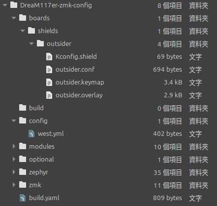

<br>

<br>

### 相依性套件錯誤處理

如果執行 `pip3 install west` 失敗，請按照下列方式執行：

1. 安裝虛擬環境建制工具：

``` bash
sudo apt install python3-venv
```

2. 在 `cd` 資料目錄下，建立 `zmk-env` 的隔離環境。

``` bash
python3 -m venv ~/zmk-env
```

3. 啓動隔離環境，你會發現終端機前面多了一行 `(zmk-env)`。

``` bash
source ~/zmk-env/bin/activate
```

4. 再執行一次 `pip3 install west` 指令。

> 注意事項：每次打開終端機，準備要編譯 `zmk` 前，都必須先執行 `source ~/zmk-env/bin/activate` 來啟動環境，然後才能用 `west build`。

<br>

### 燒錄工具設置

#### west.yml 設定

我想不到要用什麼作爲子標題，直白一點比較好：前述有提到「`west.yml` 檔案用於選擇你要使用什麼版本的 `zmk` 韌體進行燒錄」，我想來想去還是覺得這個部分必須在「新增新鍵盤」之前就必須完成，不然韌體檔案都設置完畢之後，你會看著自己的終端機乾等好久才能燒錄 `uf2` 韌體。

1. 執行 `zmk cd`，進入到 `config `資料夾，打開 `west.yml` 檔案，它會呈現這樣的架構：

``` yaml
manifest:
  defaults:
    revision: v0.3 # v0.3 改成 main
  remotes:
    - name: zmkfirmware
      url-base: https://github.com/zmkfirmware
    # Additional modules containing boards/shields/custom code can be listed here as well
    # See https://docs.zephyrproject.org/3.2.0/develop/west/manifest.html#projects
  projects:
    - name: zmk
      remote: zmkfirmware
      import: app/west.yml
  self:
    path: config
```

你會發現 `reversion` 預設會被掛載 `v0.3` ，這裡我們要將這個部分修改成 `main`，然後存檔後關閉。

2. 然後打開終端機，在 `zmk cd` 資料夾下，執行 `west update` 指令，來向 `zmk` 宇宙宣告我要使用 `main` 直接燒錄韌體。

``` bash
zmk cd
west update
```

第一次執行 `west update` 指令，就慢慢等 `git` 跑完它。

<br>

#### .gitignore 忽略清單

執行 `west update` 後，`west` 管理會將 `zmk` 的相依性套件直接從 `git` 倉庫全數掛載到 `XXX-zmk-config` 資料夾中，但不會幫你設定哪些檔案及資料夾是要進行過濾的，如果你硬是執行 `git push`，你會發現相依性套件都會在 `update list` 裡面，而且還會跳出警告，因爲相依性套件不是幾 `MB` 大小的檔案，而是好幾 `GB`。

1. 首先定位在 `zmk cd` 主資料夾，然後新增 `.gitignore`。

``` bash
zmk cd
touch .gitignore
```

2. 接著將 `.gitignore` 打開，把下面的資料清單複製進去，存檔後關閉。

``` .gitignore
# 基礎 west 及 zmk 忽略
.zmk/
.west/

# 忽視 west 下載的所有相依套件
/zephyr/
/zmk/
/modules/
/optional/

# 忽視本地編譯產生的垃圾與韌體檔
/build/

# 忽視 Python 虛擬環境
/zmk-env/
.venv/
```

3. 執行 `.gitignore` 忽略清單的上傳。

```
git add .gitignore
git commit -m "add .gitignore in config setting"
git push
```

清單設定完畢之後，執行 `git push` 就不會再報錯了，除非你 `compile` 一個新的韌體出來，它才會有新的檔案列在 `git` 的上傳清單內。

<br>

#### 導入 zephyr 引擎

`.gitignore` 的功能上述已經提及，這裡就不重複說明了。

`west update` 的功能呢？它的用意指「協助你將幾 `GB` 的純文字檔（原始碼）從 `GitHub` 搬到你的硬碟裡」，但它不具備轉換成韌體 `uf2` 的功能，由於 `zmk` 是基於 `Zephyr RTOS` 運作的嵌入式系統 `OS` ，我們就必須掛載它的相依性套件：
- `CMake` / `Ninja`。
- `Python` 資料庫。
- `Zephyr SDK`。

<br>

1. 確保你的終端機環境是在「可編譯」狀態下，執行「安裝 `CMake` / `Ninja`」步驟：

> 備註：`(zmk-env)`、`source ~/zmk-env/bin/activate`

``` bash
sudo apt install -y cmake ninja-build device-tree-compiler wget xz-utils
```

2. 鎖定 `XXX-zmk-config` 資料夾，執行：

``` bash
zmk cd
pip install -r zephyr/scripts/requirements.txt
```

3. 向 `CMake` 註冊 `Zephyr` 引擎路徑：

``` bash
west zephyr-export
```

4. 安裝 `Zephyr SDK`（`uf2` 編譯器）：

```bash
cd ~
wget https://github.com/zephyrproject-rtos/sdk-ng/releases/download/v0.16.5-1/zephyr-sdk-0.16.5-1_linux-x86_64.tar.xz
tar xvf zephyr-sdk-0.16.5-1_linux-x86_64.tar.xz
cd zephyr-sdk-0.16.5-1
./setup.sh -t arm-zephyr-eabi -c
```

> 注意：`setup.sh` 執行後，它會自動幫你把 `ARM` 的編譯器設定好，這專門用來對付 `nRF52840` 晶片。

#### 韌體編譯

5. 這樣一來，整個 `zmk` 宇宙及編譯環境就全數掛載完畢了，如果你後續要製作 `uf2` 韌體，就必須將資料夾鎖定在 `XXX-zmk-config` 目錄下的 `zmk/app` 子目錄下。

``` bash
zmk cd
cd zmk/app
```

然後再執行 `west build` 指令：

``` bash
west build -p -b nice_nano -- -DSHIELD=<custom_keyboard> -DZMK_CONFIG="[你的 XXX-zmk-config 資料夾路徑]"
```

> 超級重要：系統就會將 `uf2` 韌體建制在 `~/XXX-zmk-config/zmk/app/build/zephyr` 資料夾內部，一個叫做 `zmk.uf2` 的檔案。

<br>

## 教學開始

### A. 行星誕生

前述我們將 `zmk` 的星系開拓完且所有的前置誰設定都設置完畢後，這個 `zmk` 星系現在非常地乾淨，什麼都沒有，我們需要在這個星系裡誕生新的「行星」，這也對應著上述「何謂 zmk 星系？」 第`4-5` 點的操作方法：
- 現成的 `zmk` 宇宙設定，雲端導入到你的電腦（星系）進行配置修改。
- 從 `0` 開始創建一個「新的鍵盤」（在星系裡創建行星）。

這裡我不討論導入雲端設定的部分，著重點在於「新的鍵盤」。

<br>

1. 執行 `zmk cd`，接著在目錄底下執行：

``` bash
cd boards/shields
mkdir <custom_keyboard>
touch Kconfig.shield <custom_keyboard>.overlay <custom_keyboard>.keymap <custom_keyboard>.conf
```

> 先創建「行星（`dir`）」、「旗標（`Kconfig`）」、「運作核心（`.overlay`）」、「功能核心（`.keymap`）」、「藍牙設定（`.conf`）」檔。

2. 然後將 `Kconfig.shield` 打開，寫入代碼後存檔：

``` markdown
config SHIELD_CUSTOM_KEYBOARD
    def_bool $(shields_list_contains,<custom_keyboard>)
```

寫入這串代碼的用意在：你要告訴你的 `zmk` 宇宙環境下，誕生了這把 `custom_keyboard` 鍵盤。

> 光是創建檔案沒有用，你的 `Kconfig.shield` 檔案裡沒有東西，你要怎麼告訴宇宙「這把鍵盤」存在在這裡呢？

<br>

### B. 運作核心及功能設置

設定好鍵盤的「旗標」，接著才會依序創建「運作核心」及「功能核心」，也就是要先定義好你的鍵盤是使用什麼方式驅動 `zmk` 韌體，後續才會將鍵盤的功能一步步建立起來。

目前應該不用特別說明驅動方式，也就 2 種：
- 開發板驅動（例如：`PICO-W` 或 `SEED XIAO-BLE` 系列）。
- `MOB` 驅動（`MCU on board`）。

這裡我會介紹常用的開發板驅動，也就是 `nRF52840` 晶片的開發板（含 `nice!nano v2`）做範例介紹，首先我們需要準備幾樣東西：
1. 開發板本體。
2. 開發板規格書及腳位定義表。
3. 鍵盤電路板原理圖（`PDF` 檔案或設計圖 ）。
4. 實際鍵盤矩陣圖（`KLE` 或設計圖）。

<br>

#### 開發板本體、規格書及腳位定義表

<table>
  <tr>
    <td width="50%">
      
    </td>
    <td width="50%">
      
    </td>
  </tr>
</table>

標準使用 `ProMicro` 腳位的開發板，假設要開發無線有線共用的電路板（`PCB`）的話，那麼一定會用到這個腳位圖，這裡是這兩張圖最常用到的幾個功能：
- 對照正面、背面的 `GPIO` 分佈。
- 全域對照各個 `GPIO` 有什麼功能。

> 特別注意「電壓（`VCC`）」跟「接地（`GND`）」的位置及大小值，這個在電路設計裡面相當重要，用錯設計方法，可是會損壞你的開發板跟電路板的。

> `nice!nano v2` 跟 `clones` 的差異最大體現在「`VCC`」的大小，我記得沒錯的話，早期的 `nice!nano` 開發板 `VCC` 輸出是 `4.3V`，不是 `3V3`。

電路設計裡面幾個很簡單的概念讓大家知道一下：
- 輸出電壓不對就會罷工，或是燒掉。
- 線沒接對就會罷工，或是燒掉。

> 不正確 = 罷工 or 燒掉。

就是這麼簡單。

<br>

雖然這裡我們不討論 `RP2040 ProMicro` 開發板，但還是要跟大家說明一下「爲什麼」我要放有線鍵盤的開發板出來？
1. 你要知道 `VCC`、`GND` 的實際物理位置及電壓值。
2. 相同的 `I2C` 通訊頻道位在哪一個 `GPIO` 上，比如 `I2C0` `SDA`/`SCL` 的位置在 `GP0-1` 上。
3. 同上，`SPI` 通訊腳位位於哪一些 `GPIO` 上，走 `SPI` 頻道可是會花上更多的 `GPIO` 來處理通訊資料。

> 你要拿著有線開發板的 `GPIO` 腳位去對照 `nRF52840 ProMicro` 開發板的腳位是不是有功能的「交集」，然後把該腳位優先提取出來做佈線設計。

`nRF52840 ProMicro` 及 `nice!nano v2` 的腳位及功能都是採用相同的設計方式（使用元件不同）：
- 輸出電壓 `3V3`，`GND` 位置跟 `RP2040 ProMicro` 一樣。

> 非常重要：全功能腳位都能輸出 `I2C` 通訊。雖然全功能皆可，但建議優先使用開發板預設標示的 `SDA/SCL` 腳位，以減少軟體定義的麻煩。

> 非常重要：`RAW` 爲電池「正極」的接口。

<br>

#### 電路板原理圖及實際矩陣圖

<table>
  <tr>
    <td width="50%">
      
    </td>
    <td width="50%">
      
    </td>
  </tr>
   <tr>
    <td width="50%">
      
    </td>
    <td width="50%">
      
    </td>
  </tr>
</table>

這裡先說明兩個很常見的誤區：
1. 矩陣大小「不等於」實際矩陣圖。
2. 理想矩陣配置「不等於」實際矩陣配置。

拿範例的 `Outsider` 鍵盤來說，標準 `Plank` 配置的鍵盤矩陣大小是 `4x12`，我的設計多了一顆懸浮按鍵（音量旋鈕 `EC-11`），因此總按鍵數量是 `49` 顆。
- 理想的矩陣佈線圖一定會是 `4x12`，這很合理對吧。
- 實際上我設計了 `8x8` 的矩陣，合計 `64` 顆按鍵，比 `7x7` 矩陣還要好設計，也方便擴充跟佈線。

這樣應該能理解爲什麼了吧？

<br>

#### 寫入運作核心及功能設置 

原理圖及矩陣圖不管是 `qmk` 還是 `zmk` 韌體裡，在寫入配置的時候都相當重要，因爲你要實際去對照「你的設計」，去一個個寫入它應該要有的功能。

1. 首先我們打開 `<custom_keyboard>.overlay`，`Outsider` 的範例在下方，你可以根據註解去修改你的鍵盤 `.overlay` 檔案。

``` c
#include <dt-bindings/zmk/matrix_transform.h>

/ {
    chosen {
        zmk,kscan = &kscan0;
        zmk,matrix_transform = &default_transform;
    };

    /* 開發板設定 */
    kscan0: kscan_0 {
        compatible = "zmk,kscan-gpio-matrix";
        label = "KSCAN";
        diode-direction = "col2row"; /* 根據鍵盤的二極體方向設置 */

        /* 矩陣 Columns 腳位設定 */
        col-gpios
            = <&pro_micro 10 GPIO_ACTIVE_HIGH> /* col0: PB6 */
            , <&pro_micro 16 GPIO_ACTIVE_HIGH> /* col1: PB2 */
            , <&pro_micro 14 GPIO_ACTIVE_HIGH> /* col2: PB3 */
            , <&pro_micro 15 GPIO_ACTIVE_HIGH> /* col3: PB1 */
            , <&pro_micro 18 GPIO_ACTIVE_HIGH> /* col4: PF7 (A0) */
            , <&pro_micro 19 GPIO_ACTIVE_HIGH> /* col5: PF6 (A1) */
            , <&pro_micro 20 GPIO_ACTIVE_HIGH> /* col6: PF5 (A2) */
            , <&pro_micro 21 GPIO_ACTIVE_HIGH> /* col7: PF4 (A3) */
            ;

        /* 矩陣 Rows 腳位設定 */
        row-gpios
            = <&pro_micro 9 (GPIO_ACTIVE_HIGH | GPIO_PULL_DOWN)> /* row0: PB5 */
            , <&pro_micro 7 (GPIO_ACTIVE_HIGH | GPIO_PULL_DOWN)> /* row1: PE6 */
            , <&pro_micro 4 (GPIO_ACTIVE_HIGH | GPIO_PULL_DOWN)> /* row2: PD4 */
            , <&pro_micro 1 (GPIO_ACTIVE_HIGH | GPIO_PULL_DOWN)> /* row3: PD2 */
            , <&pro_micro 8 (GPIO_ACTIVE_HIGH | GPIO_PULL_DOWN)> /* row4: PB4 */
            , <&pro_micro 6 (GPIO_ACTIVE_HIGH | GPIO_PULL_DOWN)> /* row5: PD7 */
            , <&pro_micro 5 (GPIO_ACTIVE_HIGH | GPIO_PULL_DOWN)> /* row6: PC6 */
            , <&pro_micro 0 (GPIO_ACTIVE_HIGH | GPIO_PULL_DOWN)> /* row7: PD3 */
            ;
    };

    /* 矩陣大小設定 */
    default_transform: keymap_transform_0 {
        compatible = "zmk,matrix-transform";
        /* 定義矩陣大小 */
        columns = <8>;
        rows = <8>;
        map = <
            /* 實際矩陣大小 */
            RC(0,0) RC(4,0) RC(0,1) RC(4,1) RC(0,2) RC(4,2) RC(0,3) RC(4,3) RC(0,4) RC(4,4) RC(0,5) RC(4,5)
            RC(1,0) RC(5,0) RC(1,1) RC(5,1) RC(1,2) RC(5,2) RC(1,3) RC(5,3) RC(1,4) RC(5,4) RC(1,5) RC(5,5)
            RC(2,0) RC(6,0) RC(2,1) RC(6,1) RC(2,2) RC(6,2) RC(2,3) RC(6,3) RC(2,4) RC(6,4) RC(2,5) RC(6,5)
            RC(3,0) RC(7,0) RC(3,1) RC(7,1) RC(3,2) RC(7,2) RC(3,3) RC(7,3) RC(3,4) RC(7,4) RC(3,5) RC(7,5) RC(7,7)
        >;
        /* RC()格式說明：R = Row; C = Col; 合併代碼 = RC(A, B) */
    };
};
```

> 這個部分是設置你的硬體運作核心，因此你要在 `.overlay` 檔案裡設置，開發板上的每一個腳位定義核心功能「旗標」、「定義矩陣大小」及「實際矩陣大小」。

然後設定好「運作核心」之後，才會來設定「功能核心」——也就是你的實際矩陣中的各個按鍵上「有什麼功能」。

> 補充說明：`zmk` 針對 `ProMicro` 腳位的開發板有一套專屬的腳位定義表，這裡請參照官方說明文本的頁面——https://zmk.dev/docs/troubleshooting/hardware-issues


<br>

2. 接著打開 `.keymap` 檔案，這裡也會是你最花時間的地方，因爲每一個人理想的按鍵功能都不一樣。

``` c
#include <behaviors.dtsi>
#include <dt-bindings/zmk/keys.h>
#include <dt-bindings/zmk/bt.h>
#include <dt-bindings/zmk/pointing.h> // 這個部分是針對 HID Device 的功能及按鍵操作的資料庫

/ {
    keymap {
        compatible = "zmk,keymap";

        // Layer 0: Base
        default_layer {
            display-name = "Default Layer";
            bindings = <
                &kp ESC   &kp Q     &kp W     &kp E     &kp R     &kp T      &kp Y     &kp U     &kp I     &kp O     &kp P     &kp BSPC
                &kp LSHFT &kp A     &kp S     &kp D     &kp F     &kp G      &kp H     &kp J     &kp K     &kp L     &kp SEMI  &kp SQT
                &kp LCTRL &kp Z     &kp X     &kp C     &kp V     &kp B      &kp N     &kp M     &kp COMMA &kp DOT   &kp FSLH  &kp RET
                &mkp RCLK &mkp LCLK &mkp MCLK &kp LALT  &mo 2     &kp SPACE  &kp RSHFT &mo 1     &kp RGUI  &kp LBKT  &kp RBKT  &to 2     &kp C_MUTE
            >;
        };

        // Layer 1: Lower
        lower_layer {
            display-name = "Lower Layer";
            bindings = <
                &kp TILDE   &none   &kp EXCL  &kp AT    &kp HASH  &kp EQUAL  &kp F1    &kp F2    &kp F3    &kp F12   &none     &kp DEL
                &kp LA(TAB) &none   &kp DLLR  &kp PRCNT &kp CARET &kp UNDER  &kp F4    &kp F5    &kp F6    &kp F11   &none     &trans
                &trans      &none   &kp AMPS  &kp STAR  &kp LPAR  &kp RPAR   &kp F7    &kp F8    &kp F9    &kp F10   &kp BSLH  &trans
                &trans      &trans  &trans    &kp LALT  &kp LGUI  &kp SPACE  &kp RSHFT &trans    &trans    &trans    &trans    &to 3     &trans
            >;
        };

        // Layer 2: Raise
        raise_layer {
            display-name = "Raise Layer";
            bindings = <
                &kp GRAVE &kp KP_DIVIDE   &kp N1 &kp N2    &kp N3    &kp PLUS   &kp PG_UP &kp HOME  &kp UP    &kp END   &kp C_VOL_UP &kp BSPC
                &kp TAB   &kp KP_MULTIPLY &kp N4 &kp N5    &kp N6    &kp MINUS  &kp PG_DN &kp LEFT  &kp DOWN  &kp RIGHT &kp C_VOL_DN &kp RET
                &kp LCTRL &kp DOT         &kp N7 &kp N8    &kp N9    &kp N0     &kp LBKT  &kp RBKT  &trans    &trans    &kp BSLH     &trans
                &trans    &trans          &trans &sk LALT  &kp LGUI  &kp RET    &kp RSHFT &trans    &trans    &trans    &trans       &to 0     &trans
            >;
        };

        // Layer 3: System/Control
        sys_layer {
            display-name = "System Layer";
            bindings = <
                &none        &none        &none        &kp INS  &kp SLCK &kp PAUSE_BREAK &none   &none   &none &none &kp PSCRN &none
                &kp CAPS     &none        &none        &none    &none    &none           &none   &none   &none   &none   &none     &none
                &none        &none        &none        &none    &none    &none           &none   &none   &none   &none   &none     &none
                &none        &none        &none        &none    &none    &none           &none   &none   &none   &none   &none     &to 0     &none
            >;
        };
    };
};
```

<br>

以上 `Keymap` 是最終我針對 `Outsider` 這把鍵盤的配列去調配出來的配列代碼，下面會放上在 `QMK` 裡面的 `keymap` 對照圖，基本上有線鍵盤韌體（`QMK`）跟無線鍵盤韌體（`ZMK`）的部分，你在設計 `Keymap` 上應該不會差異太大。

<table>
  <tr>
    <td width="50%">
      
    </td>
    <td width="50%">
      
    </td>
  </tr>
   <tr>
    <td width="50%">
      
    </td>
    <td width="50%">
      
    </td>
  </tr>
</table>

<br>

至於整把鍵盤要做成什麼樣子的配列及調配花樣，這裡也是非常花時間的地方，假設你沒有多變化鍵位的需求，這部分就跳過。

<table>
      
</table>

<br>

至此，我們的本地 `zmk` 資料夾架構圖就會變成這樣：


- `boards/shields`
    - 內部的子資料夾就是本地端的 `zmk` 星系中所有的鍵盤位置所在地。
        - `Kconfig.shield` 爲行星的「旗標」，內部沒有設定該行星就不存在。
        - `.overlay` 檔案說明該行星運作規則，比方核心怎麼驅動、水流怎麼走等等。
        - `.keymap` 檔案定義該行星上有什麼東西，比方按鍵壓下去之後會跑出什麼資料給電腦。
        - `.conf` 檔案用於設備的連接設定，後續會提到。
- `config`
    - 資料夾設定該星系的主要規則，比如全域變數設定、藍牙發射功率、深度休眠模式等。
    - `west.yml` 檔案用於選擇你要使用什麼版本的 `zmk` 韌體進行燒錄。
    - `zmk.conf`。
- `zephyr`
    - `module.yml` 負責給予 `zephyr` 編譯系統宣告「這個星系是一個獨立的模組」。
- `build.yaml`
    - 給 `GitHub Actions`（`CI/CD`）查閱的指令腳本，定義「誰作爲誰的主控，輸出成 `.uf2` 韌體檔案」。

這樣一來，`zmk` 的資料夾就全面定義、解析完畢，接下來你在觀看 `zmk` 官方文本的時候，就會輕鬆許多。

> 補充說明：針對 `#include <dt-bindings/zmk/pointing.h>` 資料庫，它屬於最新版本的設定，舊版本的 `mouse.h` 已經被整合進來，如果是最新版的話，務必使用 `pointing.h` 做宣告。

<br>

#### 旋鈕設置

前面我們講述了如何針對一般按鈕的矩陣部分如何設定，因爲 `Outsider` 在預設的硬體設置方面是支援旋鈕（`Encoder`）的，這裡我會告訴大家要如何設置旋鈕的「旋轉（`Rotation`）」跟「脈衝（`Pulse`）」。

還有一部分是針對「指標設備（`Pointing Device`）」的設置，因爲 `Outsider` 的硬體端也支援，我會按照順序說明。

1. 首先我們將 `.keymap` 檔案打開，看到 `default_layer` 的區塊，加入旋鈕的「旋值」。

``` c
... 上略。

/ {
    keymap {
        compatible = "zmk,keymap";

        // Layer 0: Base
        default_layer {
            display-name = "Default Layer";
            bindings = <
                &kp ESC   &kp Q     &kp W     &kp E     &kp R     &kp T      &kp Y     &kp U     &kp I     &kp O     &kp P     &kp BSPC
                &kp LSHFT &kp A     &kp S     &kp D     &kp F     &kp G      &kp H     &kp J     &kp K     &kp L     &kp SEMI  &kp SQT
                &kp LCTRL &kp Z     &kp X     &kp C     &kp V     &kp B      &kp N     &kp M     &kp COMMA &kp DOT   &kp FSLH  &kp RET
                &mkp RCLK &mkp LCLK &mkp MCLK &kp LALT  &mo 2     &kp SPACE  &kp RSHFT &mo 1     &kp RGUI  &kp LBKT  &kp RBKT  &to 2     &kp C_MUTE
            >;
            // 旋鈕值 A、B 設定
            sensor-bindings = <&inc_dec_kp C_VOL_UP C_VOL_DN>;
        };

        // Layer 1: Lower

... 下略。
```

單一旋鈕的旋值，需要在每層 `Layer` 中都複製一個相同的 `sensor-bindings`。

如果是「每層 `Layer` 都不同的旋值」，那麼你要在每個 `Layer` 層底部都插入相應的 `sensor-bindings` 宣告。

``` c
... 上略。

/ {
    keymap {
        compatible = "zmk,keymap";

        // Layer 0: Base
        default_layer {
            ...
            // 音量控制
            sensor-bindings = <&inc_dec_kp C_VOL_UP C_VOL_DN>;
        };

        // Layer 1: Lower
        lower_layer {
            ...
            // 滑鼠滾輪
            sensor-bindings = <&inc_dec_kp mwh SCROLL_UP mwh SCROLL_DOWN>;
        };

        // Layer 2: Raise
        raise_layer {
            ...
            // 切換上一首/下一首歌
            sensor-bindings = <&inc_dec_kp C_NEXT C_PREV>;
        };
...下略。
```

<br>

3. 脈衝的部分，我們必須打開 `.overlay` 檔案，在主區域定義上加入「旋鈕」的設定：

``` c
/ {
    ...

    /* Matrix Transform */
    default_transform: keymap_transform_0 {
    ...
    };

    /* Define Encoder */
    left_encoder: encoder_left {
        compatible = "alps,ec11";
        a-gpios = <&pro_micro 2 (GPIO_ACTIVE_HIGH | GPIO_PULL_UP)>;
        b-gpios = <&pro_micro 3 (GPIO_ACTIVE_HIGH | GPIO_PULL_UP)>;
        steps = <80>; /* 物理上轉一圈有 80 個脈衝 */
        status = "okay";
    };

    /* Encoder Sensor */
    sensors {
        compatible = "zmk,keymap-sensors";
        sensors = <&left_encoder>;
        triggers-per-rotation = <20>; /* 轉一圈只觸發 20 次動作 */
    };
};
```

這個部分就跟 `QMK` 的 `Encoder` 設定很相似：

``` c
// config.h

/* Encoders */
#define ENCODER_A_PINS { GP2 }
#define ENCODER_B_PINS { GP3 }
#define ENCODER_RESOLUTION 4

// keymap.c
#if defined(ENCODER_ENABLE) || defined(ENCODER_MAP_ENABLE)
    const uint16_t PROGMEM encoder_map[][NUM_ENCODERS][NUM_DIRECTIONS] = {
        [0] = { ENCODER_CCW_CW(XXXXXXX, XXXXXXX) },
        [1] = { ENCODER_CCW_CW(XXXXXXX, XXXXXXX) },
        [2] = { ENCODER_CCW_CW(XXXXXXX, XXXXXXX) },
        [3] = { ENCODER_CCW_CW(XXXXXXX, XXXXXXX) },
    };
#endif
```

在 `ZMK` 中，我們不需要像 `QMK` 那樣直接寫出 `ENCODER_RESOLUTION 4`，而是要告訴系統「轉一圈的總脈衝數 (`steps`)」以及「轉一圈的總段落數 (`triggers-per-rotation`)」。系統會自動把兩者相除，得出這顆旋鈕的脈衝倍率。以標準 `EC-11` 為例，通常是 `80` 個脈衝除以 `20` 個段落，得出 `4` 倍脈衝；若是滑鼠編碼器（滾輪），則通常兩者數值相同，為 `1` 倍脈衝。

因此你還是要將滑鼠編碼器的「規格書」調閱出來，查閱該編碼器的脈衝值跟總數，然後將正確的值填入代碼中：

``` c
left_encoder: encoder_left {
        compatible = "alps,ec11";
        ...
        steps = <24>;  /* 物理上轉一圈有 24 個脈衝 */
    };

    sensors {
        ...
        triggers-per-rotation = <12>; /* 轉一圈要觸發 12 次動作 */
    };
```

<table>
      
</table>

4. 填好脈衝值後，最後將 `.conf` 檔案打開，把旋鈕的全域設定代碼寫入設置裡面，存檔後關閉它。

``` conf
...
# 編碼器設定
CONFIG_EC11=y
CONFIG_EC11_TRIGGER_GLOBAL_THREAD=y              # 允許旋鈕硬體中斷觸發全域執行緒
```

<br>

### C. 指標設備簡介

指標設備的話，你需要準備 `2` 件事情：
- 該指標設備的驅動方式。
    - 指標設備規格書。
    - 指標設備的元件本體。
- 你的設計圖。
    - 引腳 `IO` 是不是支援指標設備的通訊方式？

> 非常重要：指標設備需要多少的「電壓（`VCC`、`VDD`）」驅動？

常見的指標設備有「光學感應器（`sensor`）」、「搖桿編碼器（`joysitck`）」及「觸控板（`trackpad`）」，這三者涵蓋市面上 `95%` 以上的操作方式，這裡簡單介紹一下：
1. 光學感應器通常是由「元件本體」及「光學透鏡」的方式組合而成，缺一不可，需要離「感應接觸面」一段距離才能正常發揮作用。
    - 滑鼠（`mouse`）：元件及透鏡朝下，感應桌面。
    - 軌跡球（`trackball`）：元件及透鏡不朝下，感應「定規」的球體。
2. 遙桿編碼器，通常稱作「搖桿」、「小紅點（`trackpoint`）」，操作方式爲 `X`、`Y` 軸平面移動量，比較特殊的遙感編碼計算操作方式，會有 `Z` 軸的垂直量，不過在指標設備裡通常不大會用到。
3. 觸控板比較特殊，是在一定大小的平面電路感測板區域，做 `X`、`Y` 軸的計算，跟搖桿一樣，比較特殊的觸控板 `MCU` 可以計算 `Z` 軸的高度，也就是壓力值。
    - 常用的有 `Azoteq` 系列、`Cirque` 系列，這是 `qmk` 及 `zmk` 通用的型號，近期有設計師將 `Azoteq` 的觸控板也設計進 `zmk` 裡面了，我到時候也會向他學習。

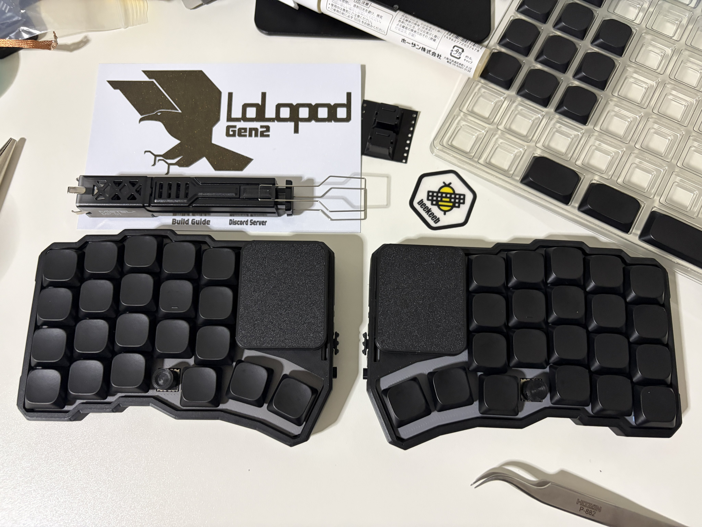
- `Lalapad Gen2` by `kot`——[X Link](https://x.com/kot149_/status/2050509588760551813) （非原設計者）。

<br>

#### 規格書要怎麼看？

規格書是我一再強調需要「優先」查閱的，小從「開關（軸體）」開始，複雜到我現在要說明的「觸控板」等，統統都要先看規格書後，再去做任何的「設計」動作：
1. 軟體設計方面你需要知道「通訊方式」、「偵測方式」。
2. 電路設計方面你需要知道「電壓」、「通訊方式」、「通訊接口怎麼接線」、「通訊接口放在哪裡」、「通訊接口的方向」等等。
3. 硬體設計方面你需要知道「這顆元件的實際大小」、「`Z` 軸干涉」、「公差」等等。

整體一起看之後才是這份規格書裡最硬的底層內容，像是「`EMI` 干涉」、「通訊轉換」、「訊號檢測」等等，這部分叫做「除錯機制」。

因此你不用把規格書想得太複雜，它不是「天書」，而是選擇「你目前需要的部分內容」去做取用及調閱。

<br>

`Outsider` 這把鍵盤是支援 `Azoteq TPS43` 及 `Cirque TM040040` 等這兩種觸控板的，我在設計上將 `EC-11`、`TPS43`、`TM040040` 等三種設備設置在相同的腳位上了。

先來看我怎麼設計：

#### EC-11

<table>
    <td width="50%">
      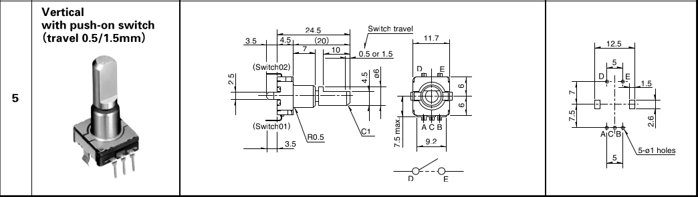
    </td>
  </tr>
   <tr>
    <td width="50%">
      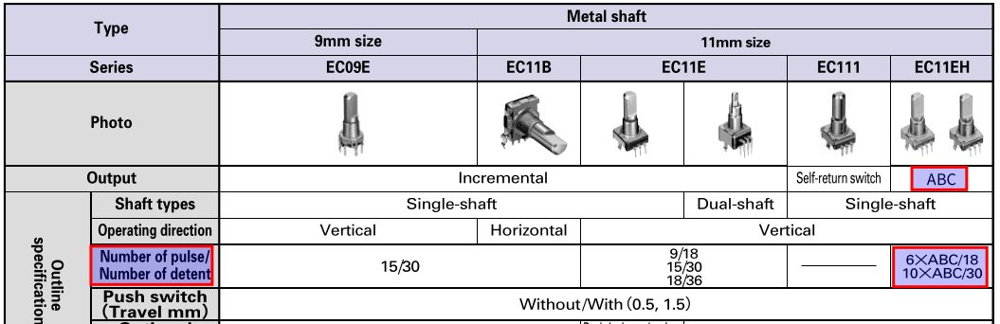
    </td>
  </tr>
</table>

`EC-11`，也就是一般常用的編碼器，如果名詞太硬核，像是順時針、逆時針轉（`CW`、`CCW`）、開關（`SW`）等等，不要把這顆元件想得太複雜。

它的名字叫做「帶開關編碼器」，你就把拆成 `2` 個部分去看就好：
1. 開關：把它當作你使用在鍵盤上的軸體。
2. 編碼器：把它當作旋轉幾個刻度就會觸發的開關，而且可以順、逆時針旋轉觸發。

夠不夠簡單？


既然分成這 `2` 個部分，那麼在開關設計上很簡單，將它設計進矩陣鍵盤裡面，當作一顆軸體使用，並且帶上二極體、接上 `col`、`row` 就完成了；

編碼器的部分，它分爲 `A`、`B`、`C` 三個 `pin`，我有說「把它當作開關使用」，但它的設計方式是獨立出來看的，因此需要「最傳統」的電路開關接法：
- 一端接訊號、一端接地。
- 那麼地（`GND`）在哪裡？這要參閱規格書，它上頭有標示 `A`、`B`、`C` 哪一個 `pin` 要接地（這裡偷偷告訴你 `EC-11` 的地是接在 `C` 的位置上）。

<br>

#### Azoteq TPS43

<table>
  <tr>
    <td width="50%">
      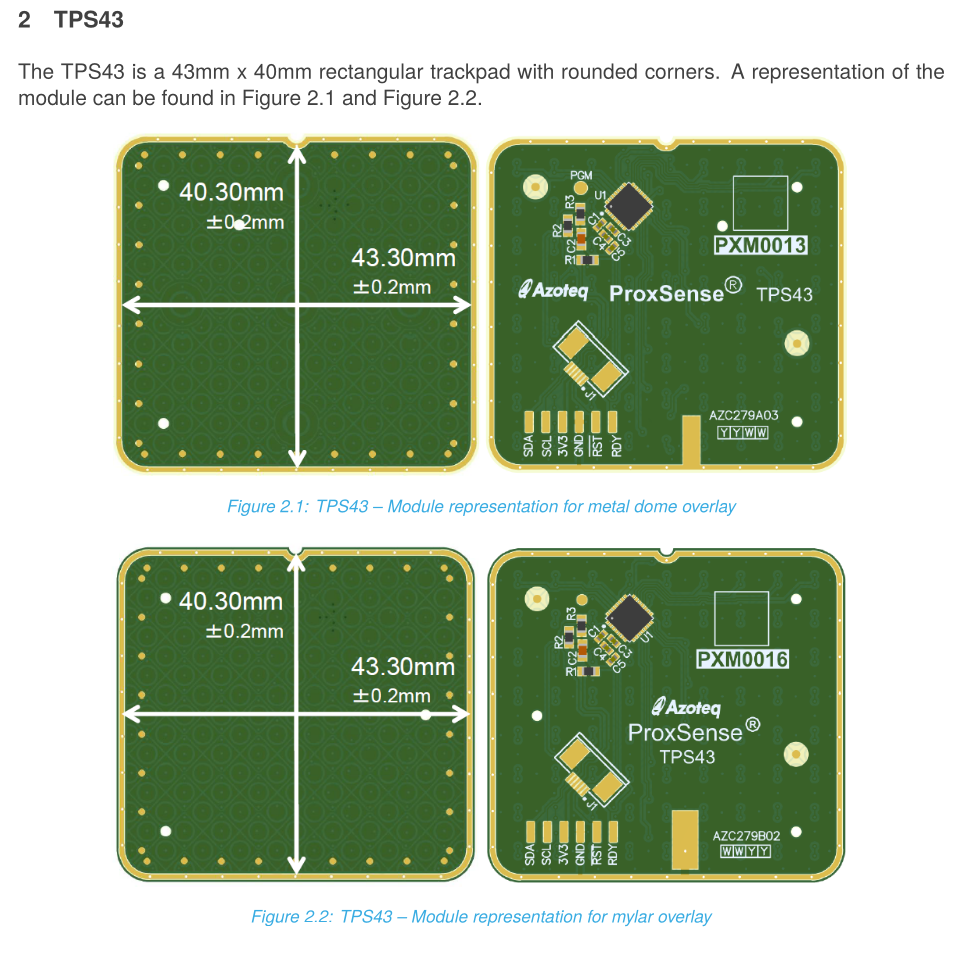
    </td>
    <td width="50%">
      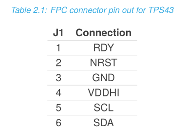
    </td>
  </tr>
   <tr>
    <td width="50%">
      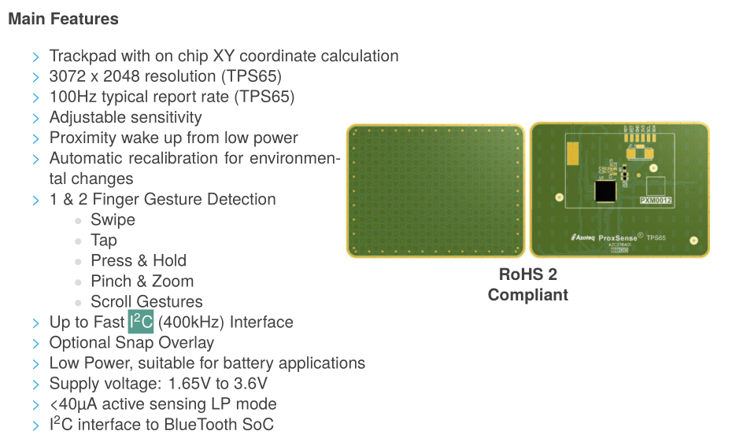
    </td>
    <td width="50%">
      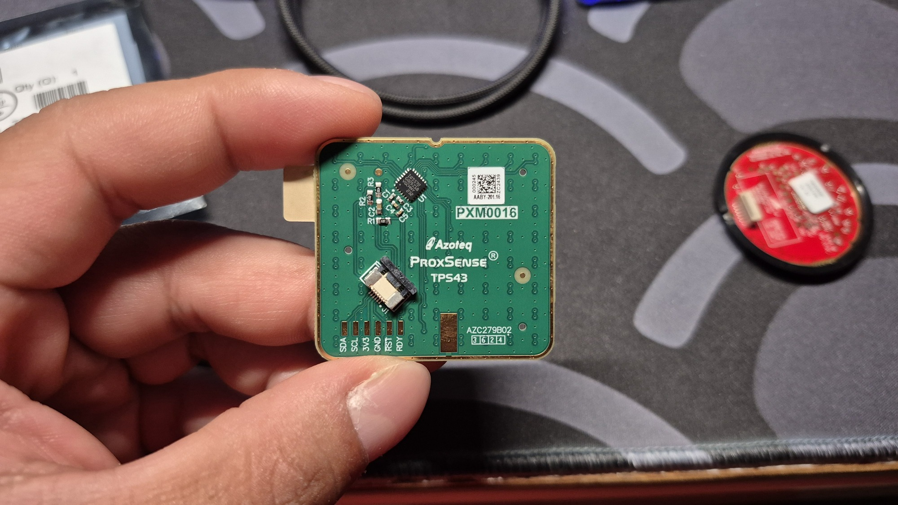
    </td>
  </tr>
</table>

`TPS43` 的部分，以下是我取用的部分：
1. 實際大小及實際型號：
    - `TPS43-201A-B`。
    - `43.3 x 40.3 mm`。
    - 經過計算後，`PCB` 厚度爲 `1.2 mm`、`3M` 雙面膠厚度爲 `0.35mm`、觸控接觸面限制爲 `1.2 mm` 以內。
    - `0.5mm FFC` 排線座厚度爲 `2 mm`、`45` 度角非對稱位。
    - `FFC` 接口分佈圖「`第 6 pin`」爲「`SDA`」。
2. 通訊方式：
    - `I2C`。
    - 運作電壓 `1.65 - 3.6V` 區間內。
    - 內建 `4.7k` 上拉電阻。

<br>

#### Cirque TM040040

<table>
  <tr>
    <td width="50%">
      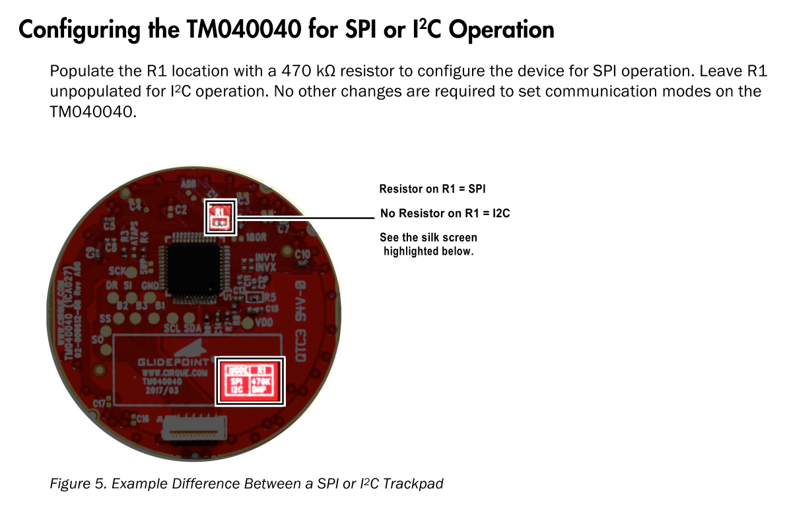
    </td>
    <td width="50%">
      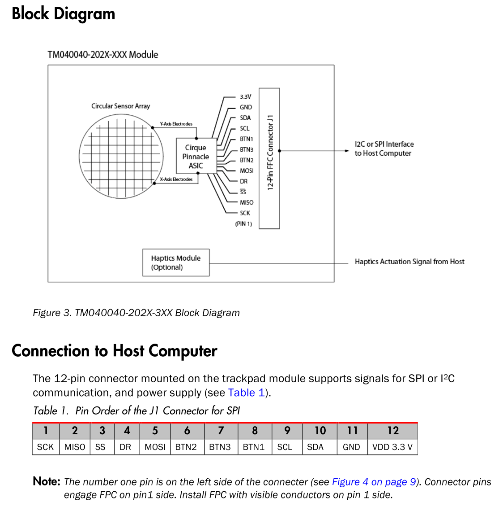
    </td>
  </tr>
   <tr>
    <td width="50%">
      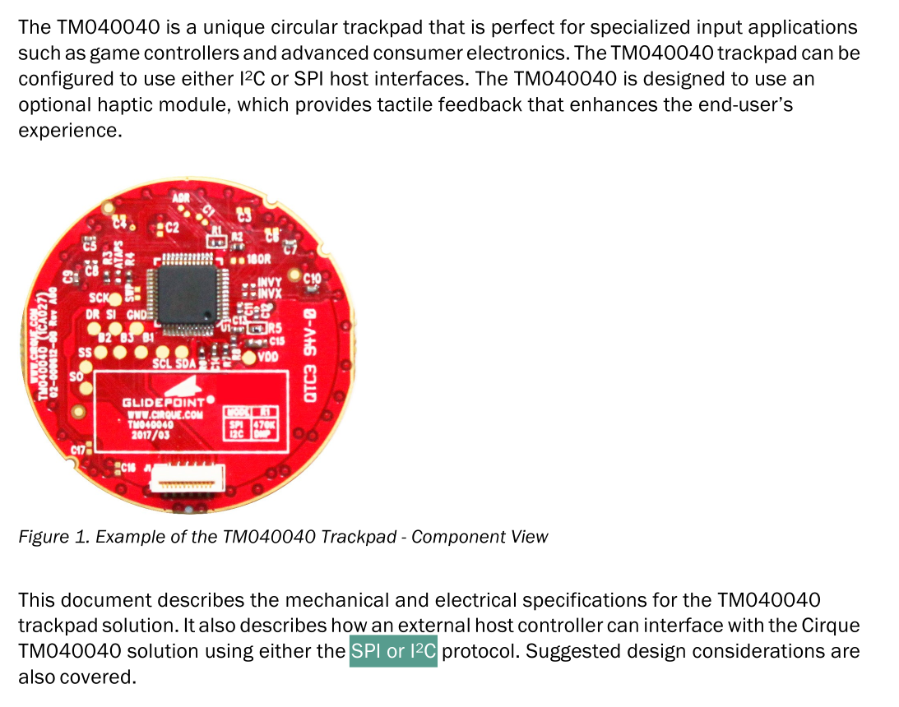
    </td>
    <td width="50%">
      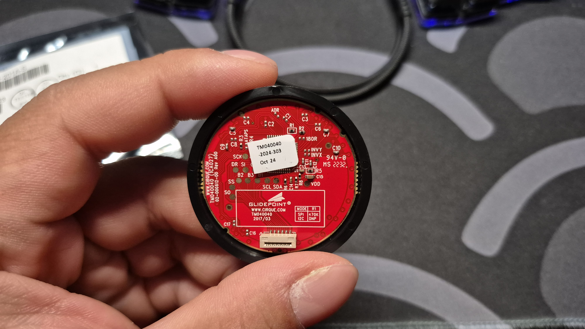
    </td>
  </tr>
</table>

`TM040040` 的部分：
1. 通訊方式及物理接口：
    - 預設 `SPI`、解焊 `R1` 電阻後支援 `I2C`。
    - `FFC 0.5mm 12pin` 垂直出線。
    - 操作電壓爲 `3V3`。
    - 無上拉電阻，需要自己設計 `4.7K` 電阻的接口。
2. 接口 `IO` 分佈：
    - `1-5` 爲 `SPI`。
    - `6-8` 爲 `SW`。
    - `9-12` 爲 `I2C`——取用這個部分。
3. 實際物理大小及元件分佈：
    - 自帶塑料碗形觸控面：凹面。
    - `FFC` 接口位於中間偏下，凸出碗口。
4. 真實計算大小（`3D` 部分）：
    - `PCB` 上 `3` 個凹口的實際位置。
    - `PCB` 上非圓形切口部分長度爲 `6.9` mm。
    - 觸控面 `Z` 軸干涉半徑爲 `23.065` mm。

經過規格書的數字計算後，`KiCAD` 的 `footprint` 及 實體 `3D` 圖都被我設計出來當作自己的參考圖形使用。

<table>
  <tr>
    <td width="50%">
      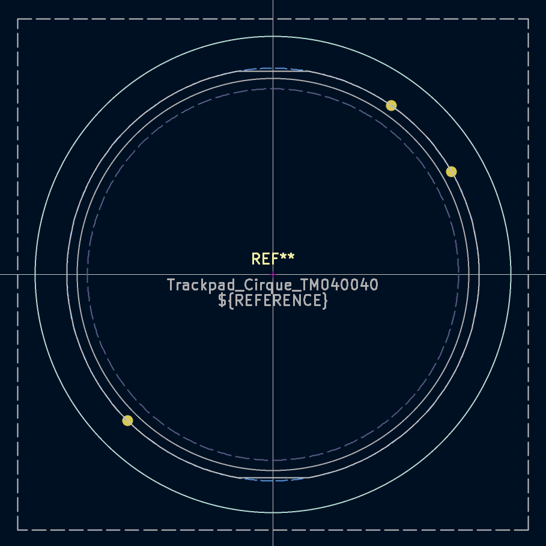
    </td>
    <td width="50%">
      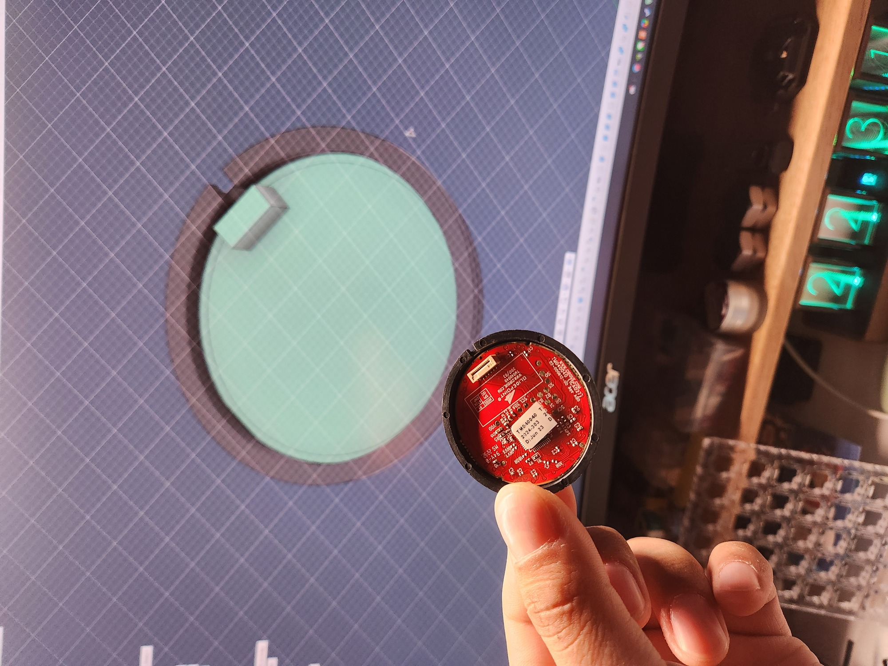
    </td>
  </tr>
</table>

<br>

- `ProMicro` 及 `nRF52840 ProMicro` （`nice!nano v2`）

<table>
  <tr>
    <td width="50%">
      
    </td>
    <td width="50%">
      
    </td>
  </tr>
</table>

沒錯，這 `2` 張「腳位定義表」又出來了，因爲它真的很重要，我有說過「取用交集的部分作爲優先設計」這句話，然後你可以計算一下我在前面取用規格書的地方有多少「交集」？
1. `I2C`。
2. `I2C` 需要 `2pin`，也就是 `SDA`、`SCL`。
3. `A`、`B`、`C`，去掉 `GND` 位置的 `C`，剩下 `A`、`B`。
4. `8x8` 的矩陣，合計 `16 pin`。
5. 兩種開發板的 `VCC` 都是輸出 `3V3`，都在 `TPS43` 及 `TM040040` 的驅動範圍。

經過規格書確認 `FFC` 排線座針對 `I2C` 的通訊方式，在 `KiCAD` 原理圖中定義好分佈方向，然後經過交叉比對電路板比較好走線的法則，於是將 `I2C` 定義在開發板 `RP2040` 及 `nRF52840 ProMicro` 的 `GP2（D2）`、`GP3（D3）`的位置上，頻道爲 `I2C1`。

旋鈕 `A`、`B` 共用 `GP2（D2）`、`GP3（D3）`腳位，因此在韌體上就必須要做交叉處理。

> 非常重要：`I2C` 通訊法則很容易被忽略的就是它的通訊是需要 `2` 個 `4.7K` 電阻各別接在 `SCA`、`SCL` 上的，電阻的另一端需要接 `VCC` ，藉由「電」把通訊頻道拉高電位。

<table>
  <tr>
    <td width="33%">
      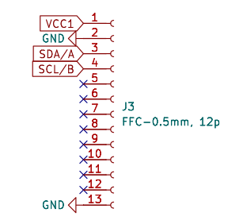
    </td>
    <td width="33%">
      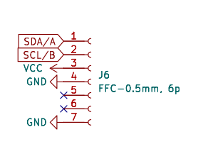
    </td>
    <td width="33%">
      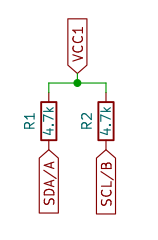
    </td>
  </tr>
</table>

<br>

#### zmk 設定項

回到 zmk 這裡。

> 這裡要特別注意，`Outsider` 的設計上是「共用腳位」，因此在做指標設備動作的時候，我會把「`Encoder`」的部分全數屏蔽掉。

操作到這裡，你會發現 `Outsider` 有一個很巨大的問題——就是它的腳位全數都被塞好塞滿了，沒有其他的擴充空間。而 `zmk` 韌體的機制會強制讓「通訊協定」藉由 `SPI` 的 `CS` 或者 `I2C` 的 `RDY` 去做觸控板的溝通。

你可以把這個「溝通」的過程當作：`A`、`B` 兩戶人家分別是隔壁鄰居，`A` 可以藉由他家的「前門」走到 `B` 家的「後門」，但無法從「前門」走到 `B` 家的「前門」；反過來，B 也一樣。

——但 `A` 可以打電話叫 `B` 起床去開門。

- `CS`、`RDY` 就是那條「電話線」。

但很可惜地，在實作上就是會多使用一個 `IO Pin`，因此這裡我不會參照官方文本的 `SPI` 通訊協定，雖然它很方便可以直接編譯，但現實上無法做到。

...既然無法做到，zmk 就可以利用「第三方」底層韌體的掛載，去擴充你的 `zmk` 宇宙編譯核心資料庫。

<br>

#### 掛載第三方資料庫

雖然 `Gemini` 有跟我提到網路上有很多大神級別的工程師在開發 `zmk` 的指標裝置韌體，但實際上我查到的目前也只有 [`halfdane`](https://github.com/halfdane) 大神的，根據時間段判斷，就是他們團隊的開發，在約一年前的時間（`2025` 年）讓 `zmk` 有了很巨大的突破。

——這裡我們要感謝他們：https://github.com/halfdane/zmk-input-gestures

首先進入到第三方函式庫的 `GitHub` 主頁，其實他們有教導大家要如何「掛載」第三方函式庫，這裡我還是會再簡化一下流程。

<br>

這裡是我們目前的 `XXX-zmk-config` 資料夾架構：


1. 首先我們進入到 `west` 資料夾內：

``` bash
# 指標設備
zmk cd
cd west
```

2. 將 `west.wml` 打開，按照第三方函式庫的操作，將掛載內容貼入檔案內後，存檔。

``` yaml
manifest:
  defaults:
    revision: main
  remotes:
    - name: zmkfirmware
      url-base: https://github.com/zmkfirmware
    # Additional modules containing boards/shields/custom code can be listed here as well
    # See https://docs.zephyrproject.org/3.2.0/develop/west/manifest.html#projects

    # 這裡加入第三方函式庫的 GitHub 主頁
    - name: halfdane
      url-base: https://github.com/halfdane/
  projects:
    - name: zmk
      remote: zmkfirmware
      import: app/west.yml
    # 在這底部加入其他模組
    - name: zmk-input-gestures
      remote: halfdane
      revision: main
    # 這裡是 absolute mode 的模組，包含了觸控板的驅動和手勢處理
    - name: zmk-input-processors
      remote: halfdane
      revision: main
    # 底下的函式庫會跟官方的產生衝突，先不要進行掛載
    # - name: cirque-input-module 
    #   remote: halfdane
    #   revision: absolute_mode
  self:
    path: config
```

3. 然後在終端機執行 `west update` 指令，然後等它掛載完畢。
4. 接著還是要手動打開 `.gitignore` 將第三方掛載的函式庫資料夾寫入排除名單內：

``` .gitignore
/zmk-input-gestures/
/zmk-input-processors/
/cirque-input-module/
```

5. 將 `.gitignore` 先行更新上 `GitHub`，然後一樣又可以正常修改鍵位、新增鍵盤了。

``` bash
git add .gitignore
git commit -m "add new module in config"
git push
```

<br>

#### 韌體模組代碼設定

> 注意事項：由於硬體端經過 `Outsider` 電路板的除錯過程當中發現 `zmk` 韌體系統底層強制要求設計者使用：
> 
> 1. `SPI` 通訊協議：`CS`。
> 2. `I2C` 通訊協議：`RDY`。
> 
> 這個部分我會另闢在底部一個大標題，轉而使用麵包板來讓大家知道運作的原理。

<br>

#### 補充說明

1. `I2C` 跟 `SPI` 是什麼其實不太重要，你只需要看著「腳位圖」去對照 `qmk` 或 `zmk` 的文本，針對「設備」的通訊方式去做處理即可，簡單說就是看圖畫葫蘆，你不用知道太多艱深的知識。

真的要說明的話，我也不懂什麼是 `I2C` 跟 `SPI`，我只知道它是「通訊法則」，還有「怎麼接線」及「初步功能」而已。

<br>

2. `I2C` 唯一要注意的是「上拉電阻」，爲什麼是 `4.7K`？

因爲這是經過公式計算過後得出來的最優解，在 `3V3` 的世界裡，你可以使用 `2.2K` 或是 `4.7K` 來應付 `400kHz` 的設備傳輸速度：
- `4.7K` 用於普通及一般情況。
- `2.2K` 用於極端情況，除非使用操作環境非常惡劣，你才有機會用到它。

簡單說，你只要看到是 `3V3` 驅動的 `I2C` 設備，毫不猶豫選擇 `4.7K` 就對了。

至於電阻規格，在 `3V3` 的世界裡其實只要是 `4.7K` 都行，你要用 `1/2W` 大小的電阻我也不反對。

<br>

### D. 設備連接設定

韌體核心功能及腳位設定完畢之後，接著要來設定「`MCU`」連接在「裝置」上的設定：
- 藍牙通訊。
- `USB` 通訊。

沒錯，有線及無線都要設置，`zmk` 韌體經過我跟朋友討論過後發現，它少了一個設定，鍵盤就會罷工。

1. 首先回到 `XXX-zmk-config` 資料夾，進入 `boards/shields/<custom_keyboard>` 資料夾目錄：

``` bash
zmk cd
cd boards/shields/<custom_keyboard>
```

2. 然後將 `.conf` 檔案打開，將連接設定寫入後存檔：

``` conf
# 藍牙設定
CONFIG_ZMK_BLE=y
CONFIG_ZMK_KEYBOARD_NAME="<custom_keyboard_BLE>" # 藍牙廣播名稱
CONFIG_BT_CTLR_TX_PWR_PLUS_8=y                   # 提升藍牙傳輸功率
CONFIG_CLOCK_CONTROL_NRF_K32SRC_RC=y             # 使用內部 RC 振盪器
CONFIG_CLOCK_CONTROL_NRF_K32SRC_500PPM=y         # RC 振盪器精度設定

# 電池設定
CONFIG_ZMK_BATTERY_REPORTING=n                   # 關閉電池報告功能

# USB 設定
CONFIG_ZMK_USB=y
...
```

如果這部分沒有設定好，`MCU` 會裝死給你看，你用其他藍牙設備也搜尋不到訊號，但連接設備的藍色燈光會一直閃爍。

> 特別注意：市面上許多的 `nice!nano v2` 克隆版跟原廠在藍牙晶片發射功率上可能有差異，這點務必先參閱「開發板原理圖」後，再根據 `zmk` 的設定來調整。這裡我就有開啓 `RC` 振盪器的校正功能，才讓我順利地用藍牙設備接收到自己的鍵盤訊號。

3. 然後打開 `.keymap` 檔案，將控制藍牙的按鍵功能設定進 `keymap` 裡面：

``` c
#include <dt-bindings/zmk/outputs.h> // 有使用到 OUT_* 系列的按鈕，參閱官方 Output Selection 文本
... 前略。
        // Layer 3: System/Control
        sys_layer {
            display-name = "System Layer";
            bindings = <
                &bt BT_CLR   &bt BT_SEL 0 &bt BT_SEL 1 &bt BT_SEL 2 &out OUT_BLE &out OUT_USB &none  &none  &kp INS  &kp SLCK &kp PAUSE_BREAK  &kp PSCRN 
                &kp CAPS     &none        &none        &none        &none        &none        &none  &none  &none    &none    &none            &none
                &none        &none        &none        &none        &none        &none        &none  &none  &none    &none    &none            &none
                &none        &none        &none        &none        &none        &none        &none  &none  &none    &none    &none            &to 0      &none
            >;
            // 藍牙設定的按鍵功能可以參閱 zmk 官方的文本進行寫入。
        };
        ...
```

藍牙連接的設備最多可以設定 `5` 組，這裡我只有設定一般市面上常規的 `3` 組連接設定。

<br>

### E. 架設 GitHub Actions

相信大家對於 `GitHub Actions` 一定不陌生，這個功能可以讓你針對現有的 `zmk` 鍵盤韌體進行 `CI/CD` 的工作，讓你直接在線上進行按鍵修改、韌體編譯。而這個動作就是將「編譯」這份工作，交給雲端超級電腦去處理。

> 註：`CI/CD`：持續整合 / 持續部署。

前面我們花了非非非非常大量的時間在架構 `zmk` 的編譯環境，在這個章節裡面，我會讓大家理解跟控制這兩部分——`GitHub Actions` 跟官方 `ZMK Studio` 的部分進行架設方法及架構解說。

1. 首先回到本地 `GitHub` 資料夾中，我們需要確認 `XXX-zmk-config` 目錄下，找到 `.github/workflows/build.yaml` 檔案。

然後將它打開：

``` yaml
name: Build ZMK firmware
on: [push, pull_request, workflow_dispatch]

jobs:
  build:
    uses: zmkfirmware/zmk/.github/workflows/build-user-config.yml@v0.3 # 改成 main
```

然後將 `v0.3` 的部分改成 `main`，隨後存檔。

> 註：`.github` 資料夾前方有一個「`.`」，這代表它屬於隱藏檔案或資料夾的意思。

2. `ZMK` 社群裡有一套非常成熟的網頁版圖形化界面，叫做「[`Keymap Editor`](https://nickcoutsos.github.io/keymap-editor/)」。

我們需要使用它，先授權綁定你的 `GitHub` 帳號，然後選擇你的 `XXX-zmk-config` 倉庫。

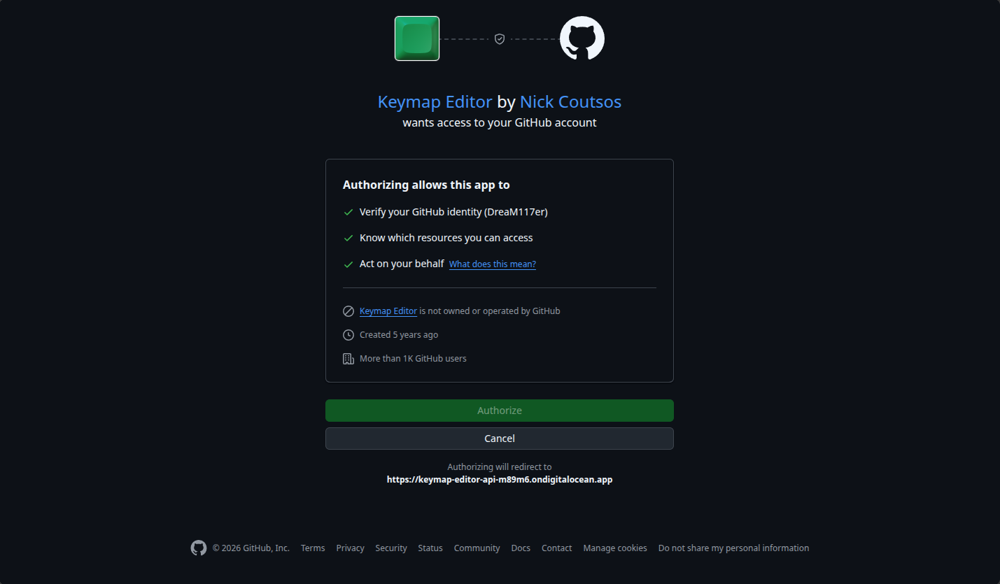

3. 接著按照 `Keymap Editor` 的指示操作，進入到 GitHub 的主頁面。

> 特別注意：第一次執行 `Keymap Editor`，它會在你的 `GitHub` 帳號中安裝套件，然後選擇「設定」的時候，指向「`XXX-zmk-config`」倉庫。

4. 然後按照標準流程操作，在 `Keymap Editor` 的界面上，它會讓你找不到鍵盤「`.keymap`」檔案，這個時候我們需要調整一下本地端的資料夾狀態：

本地端資料夾目前的結構是這樣：


<br>

我們要將 `boards` 這個資料夾整個複製下來，然後將它複製一份到 `XXX-zmk-config/config` 底下，然後將 `boards/shields` 內部的 `<custom_keyboard>` 資料夾中，`<custom_keyboard>.keymap` 移動到 `XXX-zmk-config/config` 區域（看圖）：

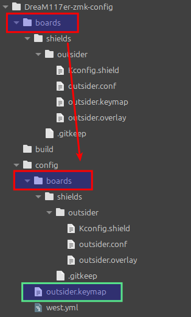

<br>

5. 改好本地資料夾結構之後，回到 `XXX-zmk-config` 目錄下，將 `build.yaml` 打開來修正後存檔：

``` yaml
# This file generates the GitHub Actions matrix.
# For simple board + shield combinations, add them to the top level board and
# shield arrays, for more control, add individual board + shield combinations
# to the `include` property. You can also use the `cmake-args` property to
# pass flags to the build command, `snippet` to add a Zephyr snippet, and
# `artifact-name` to assign a name to distinguish build outputs from each other:
#
# board: [ "nice_nano" ]
# shield: [ "corne_left", "corne_right" ]
# include:
#   - board: bdn9_rev2
#   - board: nice_nano
#     shield: reviung41
#   - board: nice_nano
#     shield: corne_left
#     snippet: studio-rpc-usb-uart
#     cmake-args: -DCONFIG_ZMK_STUDIO=y
#     artifact-name: corne_left_with_studio
#
---
# 這裡按照格式將 <custom_keyboard> 的資料寫入
include:
  - board: nice_nano//zmk # 這裡務必在後面寫上 //zmk 確保 GitHub Actions 採用相容性編譯
    shield: outsider
```

6. 然後回到終端機操作指令：

``` bash
zmk cd
git add .
git commit -m "set KME folder&update keymap"
git push
```

7. 上傳修正之後，回到 `Keymap Editor` 的界面，刷新之後就會看到上方的編譯開始在跑，你可以點擊它進去看 `GitHub Actions` 編譯韌體的狀態如何。

<table>
  <tr>
    <td width="50%">
      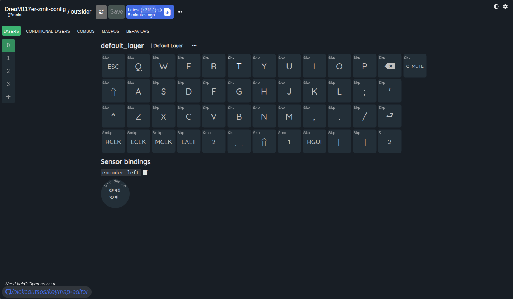
    </td>
    <td width="50%">
      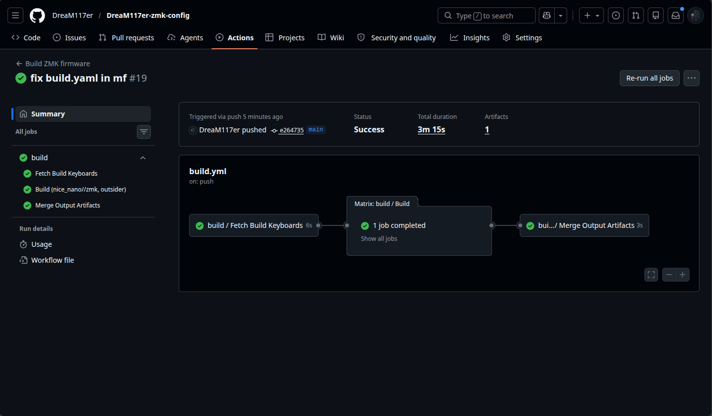
    </td>
  </tr>
</table>

<br>

> 註：`Keymap Editor` 簡稱。

8. 然後如果 `GitHub Actions` 已經跑完韌體編譯，但 `KME` 界面沒有刷新的話，重新進入一次 `GitHub Actions`，底部有下載韌體的連結。

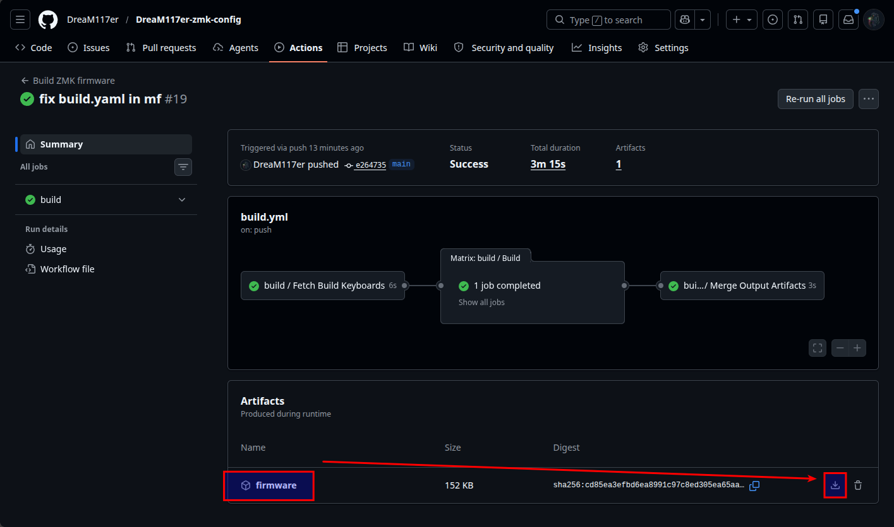

<br>

9. 接著就是大家熟悉的韌體燒錄的部分了，夠不夠簡單？

<br>

## 物理除錯法則

雖然 `zmk` 是一套關於無線鍵盤的「軟體」，但這部分應該算是我個人給大家的一個梳理邏輯的法則，給大家參考。

電路設計及韌體設計之間，有一套「灰色」地帶的法則，就是標題列出來的物理除錯，這個部分其實就分爲兩個大標題：
1. 排除法。
2. `0/1` 法則。

<br>

相信大家絕對不陌生，排除法它是「科學實驗方法」之一，在電路及韌體之間，這套法則一直都相當地好用。

公式：假設 `A + B = C` 是絕對正確的真理。那麼我可以逆向推導是 `A`、`B` 兩者其一或全部有問題，我才會在結果上無法獲得 `C`。

白話一點，按鍵沒有反應，那麼我可以先推估：
1. 韌體有沒有設定錯誤？
2. 硬體有沒有接錯位置？
3. 鍵軸 `A`、`B pin` 到 `MCU` 的位置有沒有通？
4. 過程中有沒有短路？
5. 鍵軸是壞的？

<br>

然後在這樣子的「排除法」當中，你就會發現第二個法則也在這裡面影響著你的行爲判斷——

`0/1` 法則相當地簡單，就是「有就是有，沒有就是沒有」的概念，這恰巧就是硬體、電路除錯方面的一個絕對真理。

我們根據上面的排除法做下一步延伸，假設韌體沒有設定錯誤，硬體也沒有接錯位置，我們就可以拿起「萬用電表」，將頻道轉爲「導通測試」檔，我們就可以來測試：
1. `MCU` 到鍵軸 `A pin`。
2. `MCU` 到鍵軸 `B pin`。
3. `MCU` 到二極體的 `A pin`。
4. 鍵軸 `B pin` 到二極體的 `B pin`。
5. 鍵軸 `A`、`B` 在按下去導通的時候，有沒有反應。

<br>

是不是？這樣一來你一定有辦法 `100%` 做到除錯，而且不論你遇到的是藍牙、還是更艱深的底層法則，你也有辦法利用這兩個法則做到全面解決你的大問題。

<br>

## 指標設備

> 建制中，請見諒。

<br>

## ZMK Studio

`ZMK` 曾經被 `QMK` 玩家詬病——為什麼不能像 `VIA`/`VIAL` 那樣，插上線就能即時改鍵？

官方聽到了這個聲音，於是推出了 `ZMK Studio`——它運作的底層邏輯 `VIA` 完全不同：`VIA` 是去讀寫鍵盤晶片裡的一小塊記憶體；而 `ZMK Studio` 是直接透過實體通訊去動態修改鍵盤記憶體裡的按鍵樹狀圖。

簡單說，它只要能夠連線到「你的鍵盤」，不管是不是接著「`USB`」線，還是「藍牙」都可以改按鍵。'

> 警告：這裡屬於極端的知識盲區，以下文本說明都屬於「我個人」的開荒過程，如果在執行過程中有任何錯誤的地方，都屬於「正常範圍」。

<br>

### 前置作業

1. 首先我們需要檢查 `ZMK Studio` 的底層編譯套件有沒有安裝：

``` bash
sudo apt update
sudo apt install protobuf-compiler
pip install protobuf grpcio-tools
```

2. 接下來我們需要進入到 `XXX-zmk-config` 目錄下，打開 `boards/shields/<custom_keyboard>/<custom_keyboard>.conf` 檔案，加入這行啓動代碼：

``` conf
# 開啟 ZMK Studio
CONFIG_ZMK_STUDIO=y
CONFIG_ZMK_STUDIO_LOCKING=n
```

3. 接著將 `.overlay` 打開了，寫入 `ZMK Studio` 開關代碼：

``` c
#include <physical_layouts.dtsi> /* 加入 Physical Layout 資料庫 */

/ {
    /* Physical Layout 宣告 */
    key_physical_attrs: key_physical_attrs {
        compatible = "zmk,key-physical-attrs";
        #key-cells = <7>; /* 必須宣告陣列參數有 7 個，否則編譯會報錯 */
    };

    chosen {
        zmk,kscan = &kscan0;
        /* 刪掉或屏蔽掉這行代碼，編譯 ZMK Studio 才不會報錯 */
        // zmk,matrix_transform = &default_transform;
        zmk,physical-layout = &physical_layout0;  /* 新增這行「使用實體 Layout_0」的代碼 */
    };

    /* 新增實體佈局節點 */
    physical_layout0: physical_layout_0 {
        compatible = "zmk,physical-layout";
        display-name = "Default Layout";
        kscan = <&kscan0>;
        transform = <&default_transform>;
        
        /* 這裡需要定義每一顆按鍵的物理大小與座標 */
        keys
            = 
            ;
        /* 代碼座標系另闢章節說明 */
    };

    kscan0: kscan_0 {
    ...
    };
...下略。
};
```

<br>

### 座標系統

「實體座標系統」是 `ZMK` 官方爲了對標 `VIA`/`VAIL` 而發明的新型計算系統，這裡我們需要先瞭解一下它的運作規則。

- 物理座標
  - 原點：`(X, Y)` = `(0, 0)`
  - `X` 軸：往右為「正」值。
  - `Y` 軸：往下爲「正」值。

- 單位：
  - `centi-keyunit`：以 `1/100` 爲單位計算「按鍵大小」，例如： `1U` = `100`。
  - `centi-degree`：以 `1/100` 爲單位計算「角度」，`10`度 = `1000`。

- `&key_physical_attrs`：
  - `7` 個計算值。
  - `physical_layout0: physical_layout_n` 內部以 `keys` 作爲子巨集（`n` 跟隨 `chosen` 定義的 `layout` 值）。
  - 使用方法：`<&key_physical_attrs w h x y r rx ry>`

|參數|角度|單位|
|--|--|--|
|`w`|`Width`（寬度）|`centi-keyunit`|
|`h`|`Height`（高度）|`centi-keyunit`|
|`x`|`X` 座標|按鍵「左上角」的 `X` 座標|
|`y`|`Y` 座標|按鍵「左上角」的 `Y` 座標|
|`r`|`Rotation`（旋轉）|`centi-degree`|
|`rx`|`Rotation` `X`|旋轉中心點的 `X` 座標|
|`ry`|`Rotation` `Y`|旋轉中心點的 `Y` 座標|

<br>

寫到這裡，你有沒有發現什麼東西？

> 重要：`zmk` 官方並沒有發明什麼新的座標系統，而是將 `KLE` 的計算方式全部「乘以 `100`」再去做運算。

<br>

### KLE 轉換

根據 `Gemini` 的輔助分析，針對 `ZMK Studio` 這部分，完全沒有任何的教學文本，甚至連官方也只告訴你有這個功能還有 `.conf` 要怎麼設置等等，但配套的源碼代碼都沒有說明。

> 註 1：https://zmk.dev/docs/features/studio

> 註 2：https://zmk.dev/docs/development/studio-rpc-protocol

> 註 3：https://zmk.dev/docs/config/studio

深入理解之後，我們先按照照片上的配列先做一份基礎的 `4x12` `Layout` 出來，然後再調整成標準 `Plank` 的配套。

<table>
  <tr>
    <td width="50%">
      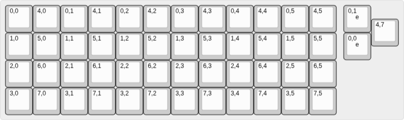
    </td>
  </tr>
  <tr>
    <td width="50%">
      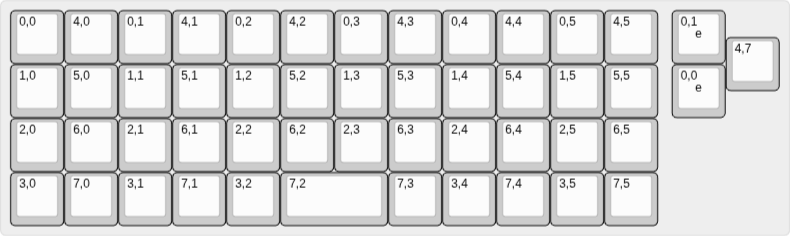
    </td>
  </tr>
</table>

<br>

> 這裡開始，會搭配 `Outsider` 專案資料夾下的 `.json` 檔案及網頁端的 `Keyboard Layout Editor` 進行說明。
> 1. `zmkstudio-default.json`
> 2. `zmkstudio-plank.json`

<br>

首先我們將 `KLE` 打開，然後將 `default` 的配列圖先匯入。

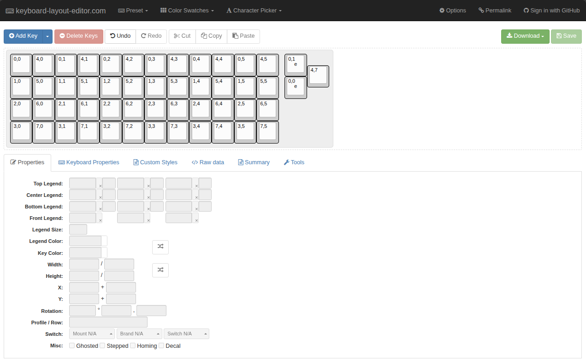

然後點選左上角第一顆按鍵，我來告訴大家接下來要怎麼去建制這個部分的代碼。

<br>

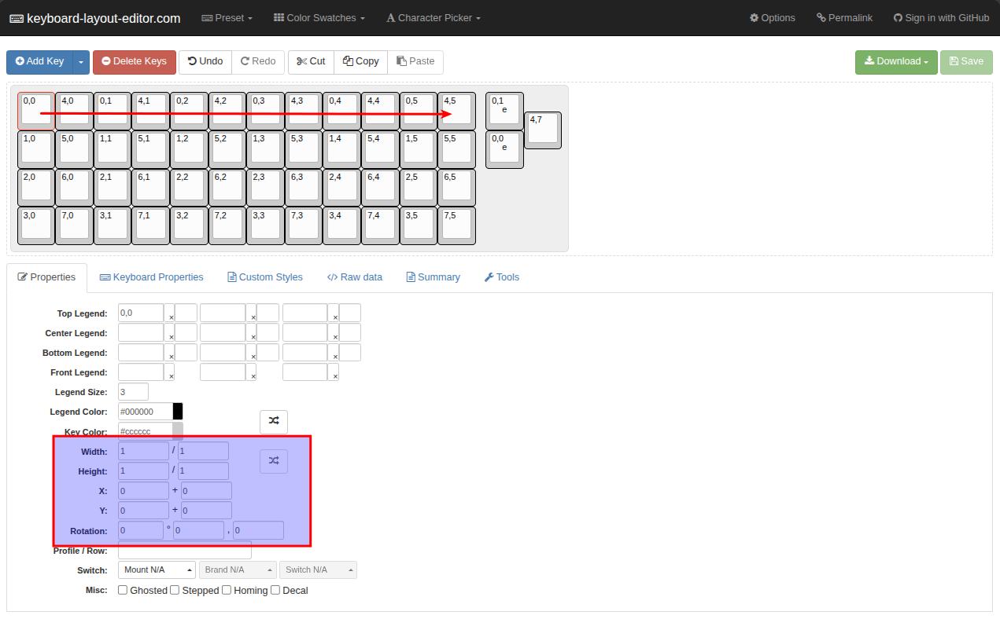

|參數|角度|單位|
|--|--|--|
|`w`|`Width`（寬度）|`centi-keyunit`|
|`h`|`Height`（高度）|`centi-keyunit`|
|`x`|`X` 座標|按鍵「左上角」的 `X` 座標|
|`y`|`Y` 座標|按鍵「左上角」的 `Y` 座標|
|`r`|`Rotation`（旋轉）|`centi-degree`|
|`rx`|`Rotation` `X`|旋轉中心點的 `X` 座標|
|`ry`|`Rotation` `Y`|旋轉中心點的 `Y` 座標|

這裡我們要按照跟 `QMK` 一樣的代碼寫入法則去處理：
1. 先從做左邊到右邊，再做上到下。
2. 紅色邊框的數值欄位分別對應上表：
    - `Width`：`w`
    - `Height`：`h`
    - `X`：`x`
    - `Y`：`y`
    - `Rotation`：`r`, `rx`, `ry`

3. `<&key_physical_attrs w h x y r rx ry>`

<br>

以此可知，先把左上角第一顆按鍵的數值先定位好，然後紅框內的數值再 `x100` 之後填入：

```c
<&key_physical_attrs 100 100   0   0 0 0 0>
```

<br>

4. 然後你就可以依序把整把鍵盤的所有按鍵都建立起來了：

```c
/ {
    ...
    /* Physical Layout */
    physical_layout0: physical_layout_0 {
        compatible = "zmk,physical-layout";
        display-name = "Default Layout";
        kscan = <&kscan0>;
        transform = <&default_transform>;
        
        /* X,Y & Units */
        keys
            /* Row0, Row4 - col0-5 */
            = <&key_physical_attrs 100 100    0    0 0 0 0>
            , <&key_physical_attrs 100 100  100    0 0 0 0>
            , <&key_physical_attrs 100 100  200    0 0 0 0>
            , <&key_physical_attrs 100 100  300    0 0 0 0>
            , <&key_physical_attrs 100 100  400    0 0 0 0>
            , <&key_physical_attrs 100 100  500    0 0 0 0>
            , <&key_physical_attrs 100 100  600    0 0 0 0>
            , <&key_physical_attrs 100 100  700    0 0 0 0>
            , <&key_physical_attrs 100 100  800    0 0 0 0>
            , <&key_physical_attrs 100 100  900    0 0 0 0>
            , <&key_physical_attrs 100 100 1000    0 0 0 0>
            , <&key_physical_attrs 100 100 1100    0 0 0 0>
            , <&key_physical_attrs 100 100 1325   50 0 0 0> // EC-11

            /* Row1, Row5 - col0-5 */
            , <&key_physical_attrs 100 100    0  100 0 0 0>
            , <&key_physical_attrs 100 100  100  100 0 0 0>
            , <&key_physical_attrs 100 100  200  100 0 0 0>
            , <&key_physical_attrs 100 100  300  100 0 0 0>
            , <&key_physical_attrs 100 100  400  100 0 0 0>
            , <&key_physical_attrs 100 100  500  100 0 0 0>
            , <&key_physical_attrs 100 100  600  100 0 0 0>
            , <&key_physical_attrs 100 100  700  100 0 0 0>
            , <&key_physical_attrs 100 100  800  100 0 0 0>
            , <&key_physical_attrs 100 100  900  100 0 0 0>
            , <&key_physical_attrs 100 100 1000  100 0 0 0>
            , <&key_physical_attrs 100 100 1100  100 0 0 0>

            /* Row2, Row6 - col0-5 */
            , <&key_physical_attrs 100 100    0  200 0 0 0>
            , <&key_physical_attrs 100 100  100  200 0 0 0>
            , <&key_physical_attrs 100 100  200  200 0 0 0>
            , <&key_physical_attrs 100 100  300  200 0 0 0>
            , <&key_physical_attrs 100 100  400  200 0 0 0>
            , <&key_physical_attrs 100 100  500  200 0 0 0>
            , <&key_physical_attrs 100 100  600  200 0 0 0>
            , <&key_physical_attrs 100 100  700  200 0 0 0>
            , <&key_physical_attrs 100 100  800  200 0 0 0>
            , <&key_physical_attrs 100 100  900  200 0 0 0>
            , <&key_physical_attrs 100 100 1000  200 0 0 0>
            , <&key_physical_attrs 100 100 1100  200 0 0 0>

            /* Row3, Row7 - col0-5 */
            , <&key_physical_attrs 100 100    0  300 0 0 0>
            , <&key_physical_attrs 100 100  100  300 0 0 0>
            , <&key_physical_attrs 100 100  200  300 0 0 0>
            , <&key_physical_attrs 100 100  300  300 0 0 0>
            , <&key_physical_attrs 100 100  400  300 0 0 0>
            , <&key_physical_attrs 100 100  500  300 0 0 0>
            , <&key_physical_attrs 100 100  600  300 0 0 0>
            , <&key_physical_attrs 100 100  700  300 0 0 0>
            , <&key_physical_attrs 100 100  800  300 0 0 0>
            , <&key_physical_attrs 100 100  900  300 0 0 0>
            , <&key_physical_attrs 100 100 1000  300 0 0 0>
            , <&key_physical_attrs 100 100 1100  300 0 0 0>
            ;
    };
};
```

<br>

### 啓動 ZMK Studio

保險一點，我個人實作到這裡建議先編譯一次，看有沒有報錯再接下去製作其他的 `Layout`。

因爲我的測試環境是 `Linux Mint`，因此在 `USB` 連接方面有很嚴格的限制... 大部分的 `Linux` 都是這樣，其他系統是需要測試的。

<br>

在編譯之前，需要進行幾個設定項目，不然你直接編譯可以過也能燒錄，但 `ZMK Studio` 絕對不會讓你開官網連接修改按鍵。

1. 回到終端機，我們需要先將 `Linux` 系統的 `USB` 網頁讀取權限打開：

```bash
sudo chmod 666 /dev/ttyACM0
sudo usermod -aG dialout $USER
```

2. 我們回到本地端 `XXX-zmk-config` 資料夾，先將目錄下的 build.yaml 打開，在 include 下方的 <custom_keyboard> 設定檔下方加入 `ZMK Studio` 的啓動碼。

``` yaml
# This file generates the GitHub Actions matrix.
# For simple board + shield combinations, add them to the top level board and
# shield arrays, for more control, add individual board + shield combinations
# to the `include` property. You can also use the `cmake-args` property to
# pass flags to the build command, `snippet` to add a Zephyr snippet, and
# `artifact-name` to assign a name to distinguish build outputs from each other:
#
# board: [ "nice_nano" ]
# shield: [ "corne_left", "corne_right" ]
# include:
#   - board: bdn9_rev2
#   - board: nice_nano
#     shield: reviung41
#   - board: nice_nano
#     shield: corne_left
#     snippet: studio-rpc-usb-uart
#     cmake-args: -DCONFIG_ZMK_STUDIO=y
#     artifact-name: corne_left_with_studio
#
---
include:
  - board: nice_nano//zmk
    shield: outsider
    snippet: studio-rpc-usb-uart # 加入這一行
```

3. 接下來就可以燒錄韌體了，但我們需要調整一下編譯指令：

``` bash
west build -p -b nice_nano -S studio-rpc-usb-uart -- -DSHIELD=<custom_keyboard> -DZMK_CONFIG="[你的 XXX-zmk-config 資料夾路徑]"
```

4. 成功編譯之後，將韌體燒錄到鍵盤裡面，然後順便測試一下鍵盤接著 `USB` 線有沒有正常運作，然後再打開 `ZMK` 官網——https://zmk.dev/
5. 官網的上方有 `ZMK Studio` 的按鈕，點進去。

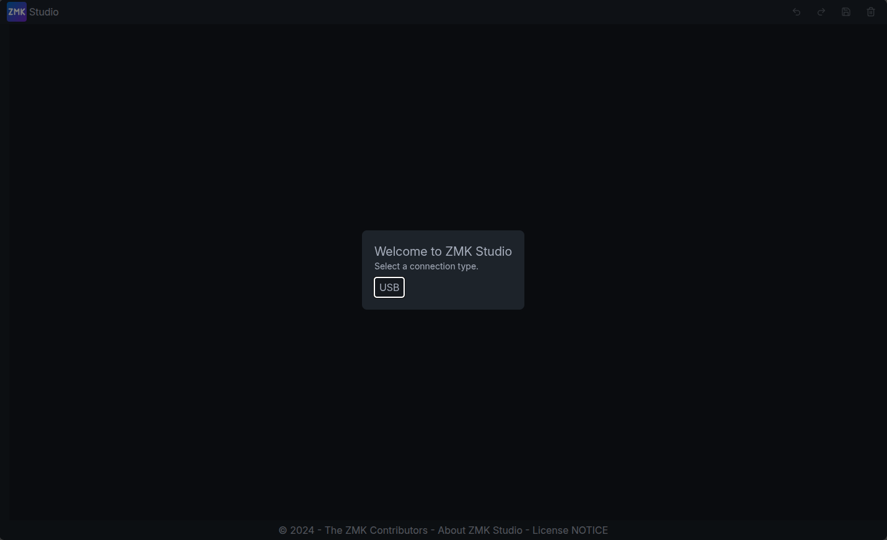

<br>

6. 點選中央的 USB 按鈕，然後就會看到網頁上方跳出一個連接選項，你的鍵盤出現在上方，那麼就成功了。

<table>
  <tr>
    <td width="50%">
      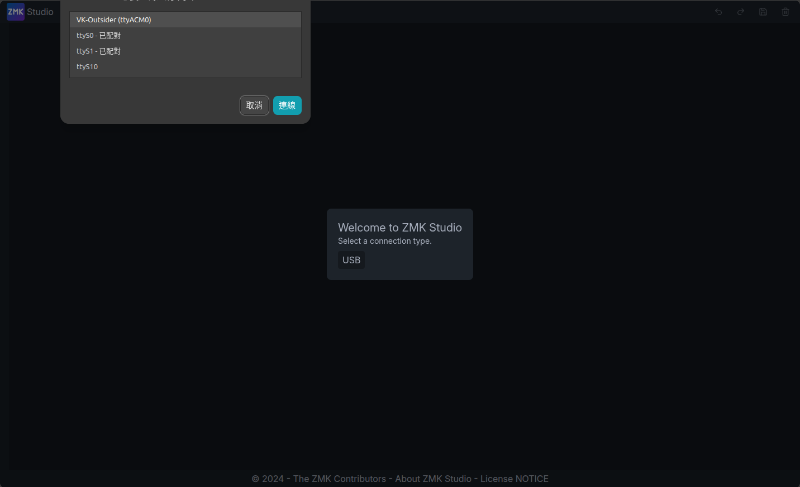
    </td>
  </tr>
  <tr>
    <td width="50%">
      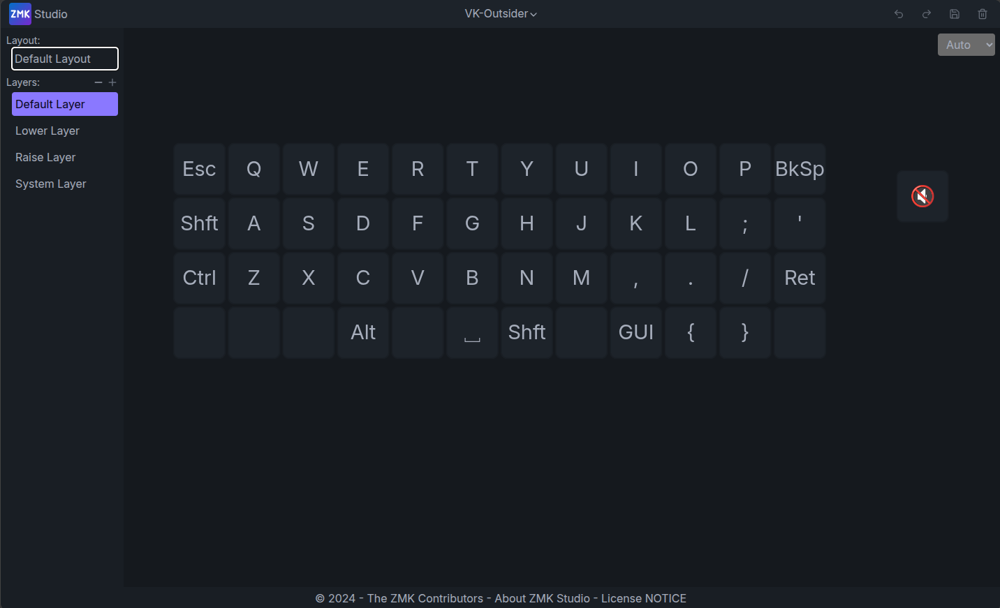
    </td>
  </tr>
</table>

<br>

### 注意事項

燒錄且讀取 `ZMK Studio` 之後，這裡要跟大家說一下這個功能的優缺點。

首先是「優點」：
- 可以不受連接限制修改按鍵功能。

> 如果還有其他的有點，我會再補上（笑）。

缺點：
- 無官方教學文本——這個非常嚴重。
  - 只有 `.conf` 大啓動項設定。
  - `.conf` 設定好之後，還有一堆的雜項需要設定。
- `Physical Layout`：
  - 不知道怎麼使用。
  - 不知道如何定義。
  - 不知道代碼怎麼寫。
  - 不知道代碼座標系統依據的標準是什麼。

以上全部都是我「逆向分析」去推導出來的，開頭我有特別強調我是「開荒」。也就是說，我個人在寫這篇文本遇到的 `Error` 次數，可能比你幾個月下來的還要多 `10` 倍，甚至更多。

<br>

回到主題，`ZMK Studio` 的限制有哪些？
1. 無法像 `VIAL` 那樣設定「選單式」修正「部分」`Layout`。
    - 自由度受限。
    - 代碼工程量非常龐大。

2. 多配列設置太多，會有單片機記憶體分配問題。
    - 深水區。

<br>

我能夠爲大家做到這種程度的開荒，也是相當意外的一件事，畢竟我早就知道 `ZMK` 本身就是一個對新手極度「不友善」的一套韌體，但沒想到不友善的程度超乎我的想象。

如果這篇附贈的教學文章能夠讓大家在藍牙設備搜尋裡面「順利地」在列表上跑出來，那麼這個意義就不一樣了。

我是 `DreaM117er`，來自臺灣的業餘鍵盤開發者，如果還有更多的機會，我會繼續開荒下去。

<br>

> 指向裝置我會再找時間用開發板獨立出來做開荒除錯，稍等我一陣子。

