# ZMK Firmware初始化環境教學

## 前言

`zmk firmware` 是客製化鍵盤圈裡最爲人熟知的無線鍵盤韌體，但一直缺少「完整」、「乾淨」的環境建制流程。爲此，我個人在初入 `zmk` 的當下，就決定要邊「執行」環境建制、然後順手寫入這個「手把手」的操作教學。

我個人非屬於韌體、硬體、電路設計等業界三大工程領域的專家，因此在接觸這種硬核的電子專案時，一定也得按照官方的操作教學，加上自己手把手除錯的嘗試，一步步將執行 SOP 建立起來，這才是屬於我的「開源精神」。

當然，我也會盡力讓教學寫得夠白話、夠詳細，希望本教學文本能將我熟知的「三大領域」完美融會貫通，一字不漏地交給在觀看文本的你，減少一些你對「開源客製化鍵盤」的一些失望、失落感。

——在點亮自己鍵盤的那一刻，那種興奮感是無與倫比的。

<br>

## 關於本教學

本教學文本適用「以下」對象：
1. 完全初學者、新手小白。
2. 按照網路上其他操作教學導致電腦異常者。
3. 按照網路上其他操作教學，成功建立個人化環境，然後找不到出錯問題怎麼解決者。
4. 三大專業領域工程師。

本教學的操作環境：`Ubuntu`、`Mint`。
本教學附屬在 `Vanguard-Keyboard-Outsider` 專案底下，因此會借用到屬於該鍵盤的設計檔案——`outsider.pdf`

<br>

## qmk 及 zmk 的差異

`zmk` 的架構跟 `qmk` 完全不一樣——`qmk` 走的是「全域資料輪詢機制」，`zmk` 走的是「樹狀資料封裝發送機制」，這裡我們必須要瞭解一下不同點：
1. `qmk` 的鍵盤主控「`MCU`」會定時、按照順序向「硬體」敲門，詢問有沒有人被按下或執行。同時，你的「`Host端`」也會定時向 `MCU` 敲門索取資料。
2. `zmk` 韌體是藉由 `Zephyr RTOS` 這個工業級的即時作業系統，來將你在單一鍵盤上的操作封裝成資料發送給「`Host端`」，因此就算是分離式鍵盤，也會被視爲「單一裝置」，跟你的「藍牙耳機」連線屬於相同的道理。

> 這裡說明的「`Host端`」，通常指的是「連線或連接」要來「操作或控制」的裝置。

`Master`、`Slave`——也就是裝置的「主」、「從」關係，`qmk` 的部分可以自由選擇定義「左」或「右」；`zmk`的話預設通常都是以「哪一端透過藍牙連上電腦」做爲 `Master`。

這樣方便大家理解一下邏輯，你也會比較容易看得懂 `zmk` 官方文本的內容在寫什麼。

<br>

## 前置作業

### 安裝相依套件

如果是純新手要入坑 `zmk` ，你會忽略掉非常多軟體工程的細節部分，這點也是我在撰寫文本的時候發現的，這裡一步步來將它們統整出來：

1. 終端機執行更新（不同發行版有各自的差異）：

``` bash
sudo apt update
```

2. 安裝 `Python3` 與 `pip3`：

``` bash
sudo apt install python3 python3-pip
```

3. 安裝 `west`：

``` bash
pip3 install west
```

<br>

### 相依性套件錯誤處理

如果執行 `pip3 install west` 失敗，請按照下列方式執行：

1. 安裝虛擬環境建制工具：

``` bash
sudo apt install python3-venv
```

2. 在 `cd` 資料目錄下，建立 `zmk-env` 的隔離環境。

``` bash
python3 -m venv ~/zmk-env
```

3. 啓動隔離環境，你會發現終端機前面多了一行 `(zmk-env)`。

``` bash
source ~/zmk-env/bin/activate
```

4. 再執行一次 `pip3 install west` 指令。

> 注意事項：每次打開終端機，準備要編譯 `zmk` 前，都必須先執行 `source ~/zmk-env/bin/activate` 來啟動環境，然後才能用 `west build`。

<br>

### 創建本地端 zmk 星系

#### 何謂 zmk 星系？

1. 首先你需要準備好你的 `GitHub` 帳號，將官方的個人化設定檔 `fork` 到你的專案目錄底下（比如：`XXX-zmk-config`）
——https://github.com/zmkfirmware/unified-zmk-config-template
2. 然後操作終端機，定位到你預設的本地 `GitHub` 倉庫目錄，執行 `zmk` 的安裝流程：https://zmk.dev/docs/user-setup
3. 執行安裝流程到 `zmk init` 的時候，將 `Repository URL` 輸入你方才建立的 `XXX-zmk-config` 的 GitHub 個人化設定檔 `repo` 網址，系統會幫你設定好 `config` 目錄
4. 接著你可以選擇輸入 `Y` 取用現成的 `zmk firmware` 設定檔爲自己網購買來的鍵盤變更 `keymap` 按鍵配置。
5. 選用 `N` 的話，終端機執行 `zmk cd`，定位在預設的 `config` 資料夾目錄。

執行到這裡，我們就已經架設好「本地端」的 `zmk` 星系環境了，接下來我會讓你瞭解 `zmk` 的宇宙架構，請繼續往下看。

<br>

目前我們的 `XXX-zmk-config` 架構圖長這樣：

- `boards/shields`
    - 內部的子資料夾就是本地端的 `zmk` 星系中所有的鍵盤位置所在地，後續會說明。
- `config`
    - 資料夾設定該星系的主要規則，比如全域變數設定、藍牙發射功率、深度休眠模式等。
    - `west.yml` 檔案用於選擇你要使用什麼版本的 `zmk` 韌體進行燒錄。
    - `zmk.conf`、`xxx.conf` 檔案用於設備的藍牙設定，後續會提到。
- `zephyr`
    - `module.yml` 負責給予 `zephyr` 編譯系統宣告「這個星系是一個獨立的模組」。
- `build.yaml`
    - 給 `GitHub Actions`（`CI/CD`）查閱的指令腳本，定義「誰作爲誰的主控，輸出成 `.uf2` 韌體檔案」。

<br>

### 燒錄工具設置

#### west.yml 設定

我想不到要用什麼作爲子標題，直白一點比較好：前述有提到「`west.yml` 檔案用於選擇你要使用什麼版本的 `zmk` 韌體進行燒錄」，我想來想去還是覺得這個部分必須在「新增新鍵盤」之前就必須完成，不然韌體檔案都設置完畢之後，你會看著自己的終端機乾等好久才能燒錄 `uf2` 韌體。

1. 執行 `zmk cd`，進入到 `config `資料夾，打開 `west.yml` 檔案，它會呈現這樣的架構：

``` yaml
manifest:
  defaults:
    revision: v0.3 # v0.3 改成 main
  remotes:
    - name: zmkfirmware
      url-base: https://github.com/zmkfirmware
    # Additional modules containing boards/shields/custom code can be listed here as well
    # See https://docs.zephyrproject.org/3.2.0/develop/west/manifest.html#projects
  projects:
    - name: zmk
      remote: zmkfirmware
      import: app/west.yml
  self:
    path: config
```

你會發現 `reversion` 預設會被掛載 `v0.3` ，這裡我們要將這個部分修改成 `main` ，然後存檔後關閉。

2. 然後打開終端機，在 `zmk cd` 資料夾下，執行 `west update` 指令，來向 `zmk` 宇宙宣告我要使用 `main` 直接燒錄韌體。

``` bash
zmk cd
west update
```

第一次執行 `west update` 指令，就慢慢等 `git` 跑完它。

<br>

#### .gitignore 忽略清單

執行 `west update` 後，`west` 管理會將 `zmk` 的相依性套件直接從 `git` 倉庫全數掛載到 `XXX-zmk-config` 資料夾中，但不會幫你設定哪些檔案及資料夾是要進行過濾的，如果你硬是執行 `git push`，你會發現相依性套件都會在 `update list` 裡面，而且還會跳出警告，因爲相依性套件不是幾 `MB` 大小的檔案，而是好幾 `GB`。

1. 首先定位在 `zmk cd` 主資料夾，然後新增 `.gitignore`。

``` bash
zmk cd
touch .gitignore
```

2. 接著將 `.gitignore` 打開，把下面的資料清單複製進去，存檔後關閉。

``` .gitignore
# 基礎 west 及 zmk 忽略
.zmk/
.west/

# 忽視 west 下載的所有相依套件
/zephyr/
/zmk/
/modules/
/optional/

# 忽視本地編譯產生的垃圾與韌體檔
/build/

# 忽視 Python 虛擬環境
/zmk-env/
.venv/
```

3. 執行 `.gitignore` 忽略清單的上傳。

```
git add .gitignore
git commit -m "add .gitignore in config setting"
git push
```

清單設定完畢之後，執行 `git push` 就不會再報錯了，除非你 `compile` 一個新的韌體出來，它才會有新的檔案列在 `git` 的上傳清單內。

<br>

#### 導入 zephyr 引擎

.gitignore 的功能上述已經提及，這裡就不重複說明了。

west update 的功能呢？它的用意指「協助你將幾 GB 的純文字檔（原始碼）從 GitHub 搬到你的硬碟裡」，但它不具備轉換成韌體 uf2 的功能，由於 zmk 是基於 Zephyr RTOS 運作的嵌入式系統 OS ，我們就必須掛載它的相依性套件：
- CMake / Ninja。
- Python 資料庫。
- Zephyr SDK。

<br>

1. 確保你的終端機環境是在「可編譯」狀態下，執行「安裝 CMake / Ninja」步驟：

> 備註：`(zmk-env)`、`source ~/zmk-env/bin/activate`

``` bash
sudo apt install -y cmake ninja-build device-tree-compiler wget xz-utils
```

2. 鎖定 `XXX-zmk-config` 資料夾，執行：

``` bash
zmk cd
pip install -r zephyr/scripts/requirements.txt
```

3. 向 CMake 註冊 Zephyr 引擎路徑：

``` bash
west zephyr-export
```

4. 安裝 Zephyr SDK（uf2 編譯器）：

```bash
cd ~
wget https://github.com/zephyrproject-rtos/sdk-ng/releases/download/v0.16.5-1/zephyr-sdk-0.16.5-1_linux-x86_64.tar.xz
tar xvf zephyr-sdk-0.16.5-1_linux-x86_64.tar.xz
cd zephyr-sdk-0.16.5-1
./setup.sh -t arm-zephyr-eabi -c
```

> 注意：`setup.sh` 執行後，它會自動幫你把 `ARM` 的編譯器設定好，這專門用來對付 `nRF52840` 晶片。

#### 韌體編譯

5. 這樣一來，整個 `zmk` 宇宙及編譯環境就全數掛載完畢了，如果你後續要製作 `uf2` 韌體，就必須將資料夾鎖定在 `XXX-zmk-config` 目錄下的 `zmk/app` 子目錄下。

``` bash
zmk cd
cd zmk/app
```

然後再執行 `west build` 指令：

``` bash
west build -s zmk/app -p -b nice_nano -- -DSHIELD=custom_keyboard -DZMK_CONFIG="[你的 XXX-zmk-config 資料夾路徑]"
```

> 超級重要：系統就會將 `uf2` 韌體建制在 `~/XXX-zmk-config/zmk/app/build/zephyr` 資料夾內部，一個叫做 `zmk.uf2` 的檔案。

<br>

## 教學開始

### A. 行星誕生

前述我們將 `zmk` 的星系開拓完且所有的前置誰設定都設置完畢後，這個 `zmk` 星系現在非常地乾淨，什麼都沒有，我們需要在這個星系裡誕生新的「行星」，這也對應著上述「何謂 zmk 星系？」 第`4-5` 點的操作方法：
- 現成的 `zmk` 宇宙設定，雲端導入到你的電腦（星系）進行配置修改。
- 從 `0` 開始創建一個「新的鍵盤」（在星系裡創建行星）。

這裡我不討論導入雲端設定的部分，著重點在於「新的鍵盤」。

<br>

1. 執行 `zmk cd` 接著在目錄底下執行：

``` bash
cd boards/shields
mkdir <custom_keyboard>
touch Kconfig.shield <custom_keyboard>.overlay <custom_keyboard>.keymap <custom_keyboard>.conf
```

> 先創建「行星（`dir`）」、「旗標（`Kconfig`）」、「運作核心（`.overlay`）」、「功能核心（`.keymap`）」、「藍牙設定（`.conf`）」檔。

2. 然後將 `Kconfig.shield` 打開，寫入代碼後存檔：

``` markdown
config SHIELD_CUSTOM_KEYBOARD
    def_bool $(shields_list_contains,<custom_keyboard>)
```

寫入這串代碼的用意在：你要告訴你的 `zmk` 宇宙環境下，誕生了這把 `custom_keyboard` 鍵盤。

> 光是創建檔案沒有用，你的 `Kconfig.shield` 檔案裡沒有東西，你要怎麼告訴宇宙「這把鍵盤」存在在這裡呢？

<br>

### B. 運作核心及功能設置

設定好鍵盤的「旗標」，接著才會依序創建「運作核心」及「功能核心」，也就是要先定義好你的鍵盤是使用什麼方式驅動 `zmk` 韌體，後續才會將鍵盤的功能一步步建立起來。

目前應該不用特別說明驅動方式，也就 2 種：
- 開發板驅動（例如：`PICO-W` 或 `SEED XIAO-BLE` 系列）。
- `MOB` 驅動（`MCU on board`）。

這裡我會介紹常用的開發板驅動，也就是 `nRF52840` 晶片的開發板（含 `nice nano v2`）做範例介紹，首先我們需要準備幾樣東西：
1. 開發板本體。
2. 開發板規格書及腳位定義表。
3. 鍵盤電路板原理圖（`PDF` 檔案或設計圖 ）。
4. 實際鍵盤矩陣圖（`KLE` 或設計圖）。

<br>

#### 開發板本體、規格書及腳位定義表

<table>
  <tr>
    <td width="50%">
      
    </td>
    <td width="50%">
      
    </td>
  </tr>
</table>

標準使用 `ProMicro` 腳位的開發板，假設要開發無線有線共用的電路板（`PCB`）的話，那麼一定會用到這個腳位圖，這裡是這兩張圖最常用到的幾個功能：
- 對照正面、背面的 `GPIO` 分佈。
- 全域對照各個 `GPIO` 有什麼功能。

> 特別注意「電壓（`VCC`）」跟「接地（`GND`）」的位置及大小值，這個在電路設計裡面相當重要，用錯設計方法，可是會損壞你的開發板跟電路板的。

> `nice nano v2` 跟 `clones` 的差異最大體現在「`VCC`」的大小，我記得沒錯的話，早期的 `nice nano` 開發板 `VCC` 輸出是 `4.3V`，不是 `3V3`。

電路設計裡面幾個很簡單的概念讓大家知道一下：
- 輸出電壓不對就會罷工，或是燒掉。
- 線沒接對就會罷工，或是燒掉。

> 不正確 = 罷工 or 燒掉。

就是這麼簡單。

<br>

雖然這裡我們不討論 `RP2040 ProMicro` 開發板，但還是要跟大家說明一下「爲什麼」我要放有線鍵盤的開發板出來？
1. 你要知道 `VCC` 、 `GND` 的實際物理位置及電壓值。
2. 相同的 `I2C` 通訊頻道位在哪一個 `GPIO` 上，比如 `I2C0` `SDA`/`SCL` 的位置在 `GP0-1` 上。
3. 同上，`SPI` 通訊腳位位於哪一些 `GPIO` 上，走 `SPI` 頻道可是會花上更多的 `GPIO` 來處理通訊資料。

> 你要拿著有線開發板的 `GPIO` 腳位去對照 `nRF52840 ProMicro` 開發板的腳位是不是有功能的「交集」，然後把該腳位優先提取出來做佈線設計。

`nRF52840 ProMicro` 及 `nice nano v2` 的腳位及功能都是採用相同的設計方式（使用元件不同）：
- 輸出電壓 `3V3`，`GND` 位置跟 `RP2040 ProMicro` 一樣。

> 非常重要：全功能腳位都能輸出 `I2C` 通訊。雖然全功能皆可，但建議優先使用開發板預設標示的 `SDA/SCL` 腳位，以減少軟體定義的麻煩。

> 非常重要：`RAW` 爲電池「正極」的接口。

<br>

#### 電路板原理圖及實際矩陣圖

<table>
  <tr>
    <td width="50%">
      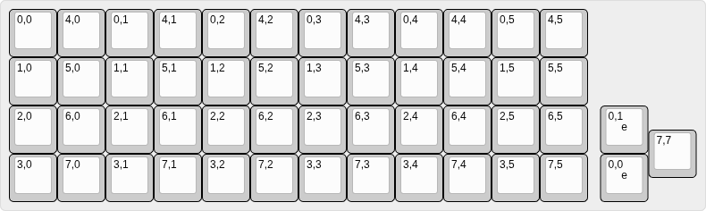
    </td>
    <td width="50%">
      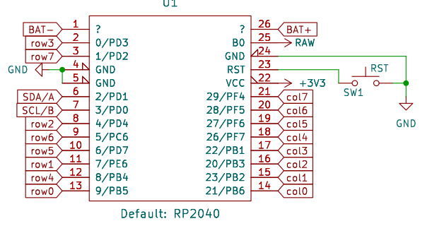
    </td>
  </tr>
   <tr>
    <td width="50%">
      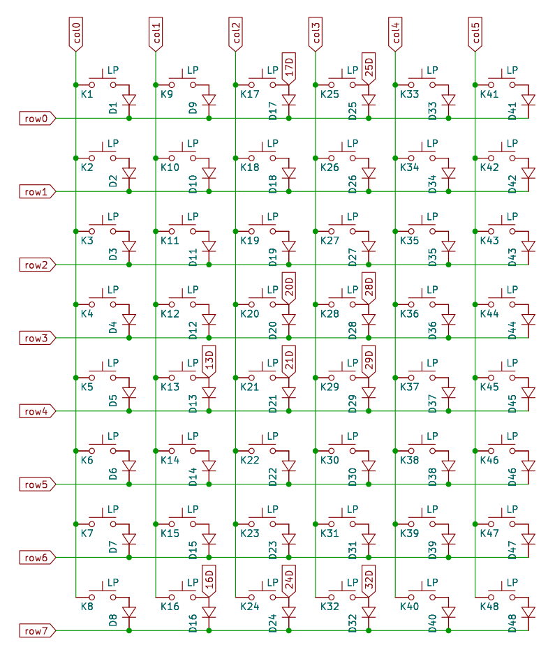
    </td>
    <td width="50%">
      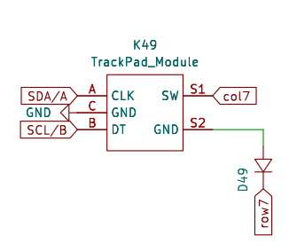
    </td>
  </tr>
</table>

這裡先說明一個很常見的幾個誤區：
1. 矩陣大小「不等於」實際矩陣圖。
2. 理想矩陣配置「不等於」實際矩陣配置。

拿範例的 `Outsider` 鍵盤來說，標準 `Plank` 配置的鍵盤矩陣大小是 `4x12`，我的設計多了一顆懸浮按鍵（音量旋鈕 `EC-11`），因此總按鍵數量是 `49` 顆。
- 理想的矩陣佈線圖一定會是 `4x12`，這很合理對吧。
- 實際上我設計了 `8x8` 的矩陣，合計 `64` 顆按鍵，比 `7x7` 矩陣還要好設計，也方便擴充跟佈線。

這樣應該能理解爲什麼了吧？

<br>

#### 寫入運作核心及功能設置 

原理圖及矩陣圖不管是 `qmk` 還是 `zmk` 韌體裡，在寫入配置的時候都相當重要，因爲你要實際去對照「你的設計」，去一個個寫入它應該要有的功能。

1. 首先我們打開 `<custom_keyboard>.overlay`，`Outsider` 的範例在下方，你可以根據註解去修改你的鍵盤 `.overlay` 檔案。

``` c
#include <dt-bindings/zmk/matrix_transform.h>

/ {
    chosen {
        zmk,kscan = &kscan0;
        zmk,matrix_transform = &default_transform;
    };

    /* 開發板設定 */
    kscan0: kscan_0 {
        compatible = "zmk,kscan-gpio-matrix";
        label = "KSCAN";
        diode-direction = "col2row"; /* 根據鍵盤的二極體方向設置 */

        /* 矩陣 Columns 腳位設定 */
        col-gpios
            = <&pro_micro 10 GPIO_ACTIVE_HIGH> /* col0: PB6 */
            , <&pro_micro 16 GPIO_ACTIVE_HIGH> /* col1: PB2 */
            , <&pro_micro 14 GPIO_ACTIVE_HIGH> /* col2: PB3 */
            , <&pro_micro 15 GPIO_ACTIVE_HIGH> /* col3: PB1 */
            , <&pro_micro 18 GPIO_ACTIVE_HIGH> /* col4: PF7 (A0) */
            , <&pro_micro 19 GPIO_ACTIVE_HIGH> /* col5: PF6 (A1) */
            , <&pro_micro 20 GPIO_ACTIVE_HIGH> /* col6: PF5 (A2) */
            , <&pro_micro 21 GPIO_ACTIVE_HIGH> /* col7: PF4 (A3) */
            ;

        /* 矩陣 Rows 腳位設定 */
        row-gpios
            = <&pro_micro 9 (GPIO_ACTIVE_HIGH | GPIO_PULL_DOWN)> /* row0: PB5 */
            , <&pro_micro 7 (GPIO_ACTIVE_HIGH | GPIO_PULL_DOWN)> /* row1: PE6 */
            , <&pro_micro 4 (GPIO_ACTIVE_HIGH | GPIO_PULL_DOWN)> /* row2: PD4 */
            , <&pro_micro 1 (GPIO_ACTIVE_HIGH | GPIO_PULL_DOWN)> /* row3: PD2 */
            , <&pro_micro 8 (GPIO_ACTIVE_HIGH | GPIO_PULL_DOWN)> /* row4: PB4 */
            , <&pro_micro 6 (GPIO_ACTIVE_HIGH | GPIO_PULL_DOWN)> /* row5: PD7 */
            , <&pro_micro 5 (GPIO_ACTIVE_HIGH | GPIO_PULL_DOWN)> /* row6: PC6 */
            , <&pro_micro 0 (GPIO_ACTIVE_HIGH | GPIO_PULL_DOWN)> /* row7: PD3 */
            ;
    };

    /* 矩陣大小設定 */
    default_transform: keymap_transform_0 {
        compatible = "zmk,matrix-transform";
        /* 定義矩陣大小 */
        columns = <8>;
        rows = <8>;
        map = <
            /* 實際矩陣大小 */
            RC(0,0) RC(4,0) RC(0,1) RC(4,1) RC(0,2) RC(4,2) RC(0,3) RC(4,3) RC(0,4) RC(4,4) RC(0,5) RC(4,5)
            RC(1,0) RC(5,0) RC(1,1) RC(5,1) RC(1,2) RC(5,2) RC(1,3) RC(5,3) RC(1,4) RC(5,4) RC(1,5) RC(5,5)
            RC(2,0) RC(6,0) RC(2,1) RC(6,1) RC(2,2) RC(6,2) RC(2,3) RC(6,3) RC(2,4) RC(6,4) RC(2,5) RC(6,5)
            RC(3,0) RC(7,0) RC(3,1) RC(7,1) RC(3,2) RC(7,2) RC(3,3) RC(7,3) RC(3,4) RC(7,4) RC(3,5) RC(7,5) RC(7,7)
        >;
        /* RC()格式說明：R = Row; C = Col; 合併代碼 = RC(A, B) */
    };
};
```

> 這個部分是設置你的硬體運作核心，因此你要在 `.overlay` 檔案裡設置，開發板上的每一個腳位定義核心功能「旗標」、「定義矩陣大小」及「實際矩陣大小」。

然後設定好「運作核心」之後，才會來設定「功能核心」——也就是你的實際矩陣中的各個按鍵上「有什麼功能」。

> 補充說明：`zmk` 針對 `ProMicro` 腳位的開發板有一套專屬的腳位定義表，這裡請參照官方說明文本的頁面——https://zmk.dev/docs/troubleshooting/hardware-issues


<br>

2. 接著打開 `.keymap` 檔案，這裡也會是你最花時間的地方，因爲每一個人理想的按鍵功能都不一樣。

``` c
#include <behaviors.dtsi>
#include <dt-bindings/zmk/keys.h>
#include <dt-bindings/zmk/bt.h>
#include <dt-bindings/zmk/pointing.h> // 這個部分是針對 HID Device 的功能及按鍵操作的資料庫

/ {
    keymap {
        compatible = "zmk,keymap";

        // Layer 0: Base
        default_layer {
            display-name = "Default Layer";
            bindings = <
                &kp ESC   &kp Q     &kp W     &kp E     &kp R     &kp T      &kp Y     &kp U     &kp I     &kp O     &kp P     &kp BSPC
                &kp LSHFT &kp A     &kp S     &kp D     &kp F     &kp G      &kp H     &kp J     &kp K     &kp L     &kp SEMI  &kp SQT
                &kp LCTRL &kp Z     &kp X     &kp C     &kp V     &kp B      &kp N     &kp M     &kp COMMA &kp DOT   &kp FSLH  &kp RET
                &mkp RCLK &mkp LCLK &mkp MCLK &kp LALT  &mo 2     &kp SPACE  &kp RSHFT &mo 1     &kp RGUI  &kp LBKT  &kp RBKT  &to 2     &kp C_MUTE
            >;
        };

        // Layer 1: Lower
        lower_layer {
            display-name = "Lower Layer";
            bindings = <
                &kp TILDE   &none   &kp EXCL  &kp AT    &kp HASH  &kp EQUAL  &kp F1    &kp F2    &kp F3    &kp F12   &none     &kp DEL
                &kp LA(TAB) &none   &kp DLLR  &kp PRCNT &kp CARET &kp UNDER  &kp F4    &kp F5    &kp F6    &kp F11   &none     &trans
                &trans      &none   &kp AMPS  &kp STAR  &kp LPAR  &kp RPAR   &kp F7    &kp F8    &kp F9    &kp F10   &kp BSLH  &trans
                &trans      &trans  &trans    &kp LALT  &kp LGUI  &kp SPACE  &kp RSHFT &trans    &trans    &trans    &trans    &to 3     &trans
            >;
        };

        // Layer 2: Raise
        raise_layer {
            display-name = "Raise Layer";
            bindings = <
                &kp GRAVE &kp KP_DIVIDE   &kp N1 &kp N2    &kp N3    &kp PLUS   &kp PG_UP &kp HOME  &kp UP    &kp END   &kp C_VOL_UP &kp BSPC
                &kp TAB   &kp KP_MULTIPLY &kp N4 &kp N5    &kp N6    &kp MINUS  &kp PG_DN &kp LEFT  &kp DOWN  &kp RIGHT &kp C_VOL_DN &kp RET
                &kp LCTRL &kp DOT         &kp N7 &kp N8    &kp N9    &kp N0     &kp LBKT  &kp RBKT  &trans    &trans    &kp BSLH     &trans
                &trans    &trans          &trans &sk LALT  &kp LGUI  &kp RET    &kp RSHFT &trans    &trans    &trans    &trans       &to 0     &trans
            >;
        };

        // Layer 3: System/Control
        sys_layer {
            display-name = "System Layer";
            bindings = <
                &none        &none        &none        &kp INS  &kp SLCK &kp PAUSE_BREAK &none   &none   &none &none &kp PSCRN &none
                &kp CAPS     &none        &none        &none    &none    &none           &none   &none   &none   &none   &none     &none
                &none        &none        &none        &none    &none    &none           &none   &none   &none   &none   &none     &none
                &none        &none        &none        &none    &none    &none           &none   &none   &none   &none   &none     &to 0     &none
            >;
        };
    };
};
```

<br>

以上 `Keymap` 是 最終我針對 `Outsider` 這把鍵盤的配列去調配出來的配列代碼，下面會放上在 `QMK` 裡面的 `keymap` 對照圖，基本上現在的有線鍵盤韌體（`QMK`）跟無線鍵盤韌體（`ZMK`）的部分，你在設計 `Keymap` 上應該不會差異太大。

<table>
  <tr>
    <td width="50%">
      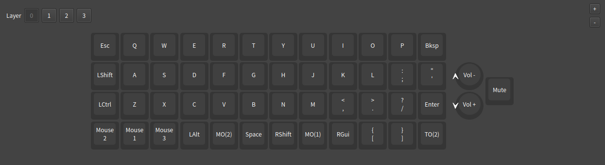
    </td>
    <td width="50%">
      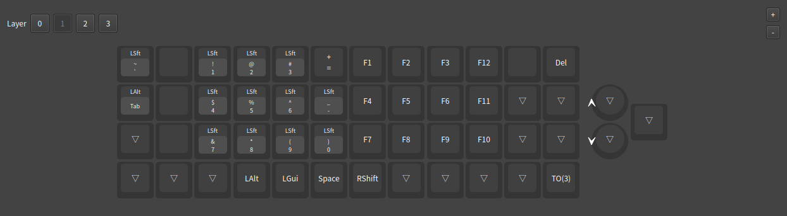
    </td>
  </tr>
   <tr>
    <td width="50%">
      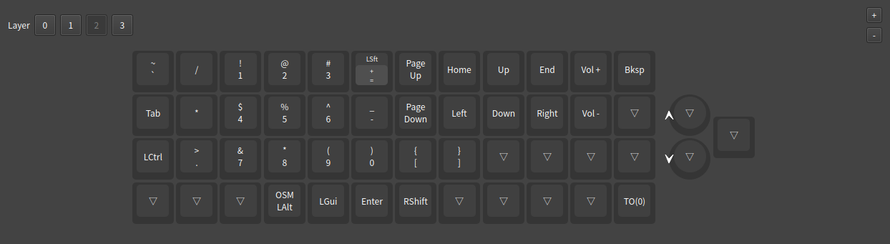
    </td>
    <td width="50%">
      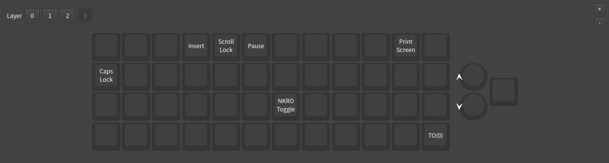
    </td>
  </tr>
</table>

<br>

至於整把鍵盤要做成什麼樣子的配列及調配花樣，這裡也是非常花時間的地方，假設你沒有多變化鍵位的需求，這部分就跳過。

<table>
      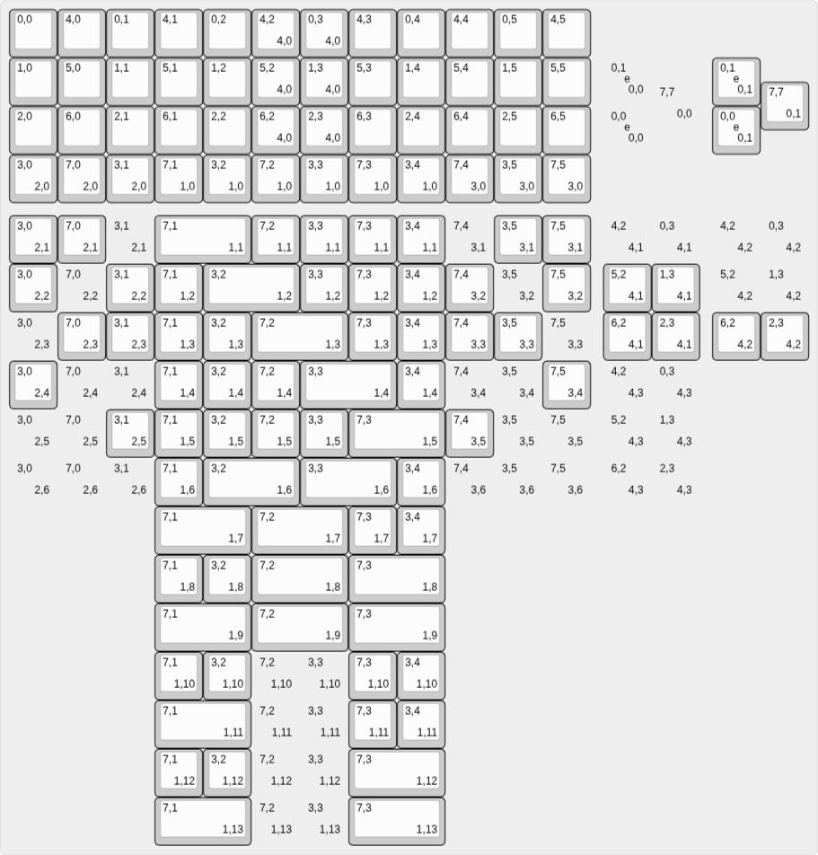
</table>

<br>

至此，我們的本地 `zmk` 資料夾架構圖就會變成這樣：

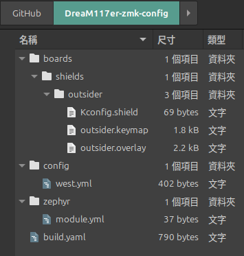

- `boards/shields`
    - 內部的子資料夾就是本地端的 `zmk` 星系中所有的鍵盤位置所在地。
        - `Kconfig.shield` 爲行星的「旗標」，內部沒有設定就不存在該行星的存在。
        - `.overlay` 檔案說明該行星運作規則，比方核心怎麼驅動、水流怎麼走等等。
        - `.keymap` 檔案定義該行星上有什麼東西，比方按鍵壓下去之後會跑出什麼資料給電腦。
- `config`
    - 資料夾設定該星系的主要規則，比如全域變數設定、藍牙發射功率、深度休眠模式等。
    - `west.yml` 檔案用於選擇你要使用什麼版本的 `zmk` 韌體進行燒錄。
    - `zmk.conf`、`xxx.conf` 檔案用於設備的藍牙設定，後續會提到。
- `zephyr`
    - `module.yml` 負責給予 `zephyr` 編譯系統宣告「這個星系是一個獨立的模組」。
- `build.yaml`
    - 給 `GitHub Actions`（`CI/CD`）查閱的指令腳本，定義「誰作爲誰的主控，輸出成 `.uf2` 韌體檔案」。

這樣一來，`zmk` 的資料夾就全面定義、解析完畢，接下來你在觀看 `zmk` 官方文本的時候，就會輕鬆許多。

> 補充說明：針對 `#include <dt-bindings/zmk/pointing.h>` 資料庫，它屬於最新版本的設定，舊版本的 `mouse.h` 已經被整合進來，如果是最新版的話，務必使用 `pointing.h` 做宣告。

<br>

#### 旋鈕設置

前面我們講述了如何針對一般按鈕的矩陣部分如何設定，因爲 `Outsider` 在預設的硬體設置方面是支援旋鈕（`Encoder`）的，這裡我會告訴大家要如何設置旋鈕的「旋轉（`Rotation`）」跟「脈衝（`Pulse`）」。

還有一部分是針對「指標設備（`Pointing Device`）」的設置，因爲 `Outsider` 的硬體端也支援，我會按照順序說明。

1. 首先我們將 `.keymap` 檔案打開，看到 `default_layer` 的區塊，加入旋鈕的「旋值」。

``` c
... 上略。

/ {
    keymap {
        compatible = "zmk,keymap";

        // Layer 0: Base
        default_layer {
            display-name = "Default Layer";
            bindings = <
                &kp ESC   &kp Q     &kp W     &kp E     &kp R     &kp T      &kp Y     &kp U     &kp I     &kp O     &kp P     &kp BSPC
                &kp LSHFT &kp A     &kp S     &kp D     &kp F     &kp G      &kp H     &kp J     &kp K     &kp L     &kp SEMI  &kp SQT
                &kp LCTRL &kp Z     &kp X     &kp C     &kp V     &kp B      &kp N     &kp M     &kp COMMA &kp DOT   &kp FSLH  &kp RET
                &mkp RCLK &mkp LCLK &mkp MCLK &kp LALT  &mo 2     &kp SPACE  &kp RSHFT &mo 1     &kp RGUI  &kp LBKT  &kp RBKT  &to 2     &kp C_MUTE
            >;
            // 旋鈕值 A、B 設定
            sensor-bindings = <&inc_dec_kp C_VOL_UP C_VOL_DN>;
        };

        // Layer 1: Lower

... 下略。
```

以上是單一旋鈕值的設置，如果你在各個 `Layer` 層操作旋鈕都想要一樣的輸出值，那麼只要在 `default_layer` 做 `sensor-bindings` 的宣告即可。

如果是「每層 `Layer` 都不同的旋值」，那麼你要在每個 `Layer` 層底部都插入相應的 `sensor-bindings` 宣告。

``` c
... 上略。

/ {
    keymap {
        compatible = "zmk,keymap";

        // Layer 0: Base
        default_layer {
            ...
            // 音量控制
            sensor-bindings = <&inc_dec_kp C_VOL_UP C_VOL_DN>;
        };

        // Layer 1: Lower
        lower_layer {
            ...
            // 滑鼠滾輪
            sensor-bindings = <&inc_dec_kp mwh SCROLL_UP mwh SCROLL_DOWN>;
        };

        // Layer 2: Raise
        raise_layer {
            ...
            // 切換上一首/下一首歌
            sensor-bindings = <&inc_dec_kp C_NEXT C_PREV>;
        };
...下略。
```

<br>

3. 脈衝的部分，我們必須打開 `.overlay` 檔案，在主區域定義上加入「旋鈕」的設定：

``` c
/ {
    ...

    /* Matrix Transform */
    default_transform: keymap_transform_0 {
    ...
    };

    /* Define Encoder */
    left_encoder: encoder_left {
        compatible = "alps,ec11";
        a-gpios = <&pro_micro 2 (GPIO_ACTIVE_HIGH | GPIO_PULL_UP)>;
        b-gpios = <&pro_micro 3 (GPIO_ACTIVE_HIGH | GPIO_PULL_UP)>;
        steps = <80>; /* 物理上轉一圈有 80 個脈衝 */
        status = "okay";
    };

    /* Encoder Sensor */
    sensors {
        compatible = "zmk,keymap-sensors";
        sensors = <&left_encoder>;
        triggers-per-rotation = <20>; /* 轉一圈只觸發 20 次動作 */
    };
};
```

這個部分就跟 QMK 的 Encoder 設定很相似：

``` c
// config.h

/* Encoders */
#define ENCODER_A_PINS { GP2 }
#define ENCODER_B_PINS { GP3 }
#define ENCODER_RESOLUTION 4

// keymap.c
#if defined(ENCODER_ENABLE) || defined(ENCODER_MAP_ENABLE)
    const uint16_t PROGMEM encoder_map[][NUM_ENCODERS][NUM_DIRECTIONS] = {
        [0] = { ENCODER_CCW_CW(XXXXXXX, XXXXXXX) },
        [1] = { ENCODER_CCW_CW(XXXXXXX, XXXXXXX) },
        [2] = { ENCODER_CCW_CW(XXXXXXX, XXXXXXX) },
        [3] = { ENCODER_CCW_CW(XXXXXXX, XXXXXXX) },
    };
#endif
```

在 `ZMK` 中，我們不需要像 `QMK` 那樣直接寫出 `ENCODER_RESOLUTION 4`，而是要告訴系統「轉一圈的總脈衝數 (`steps`)」以及「轉一圈的總段落數 (`triggers-per-rotation`)」。系統會自動把兩者相除，得出這顆旋鈕的脈衝倍率。以標準 `EC-11` 為例，通常是 `80` 個脈衝除以 `20` 個段落，得出 `4` 倍脈衝；若是滑鼠編碼器（滾輪），則通常兩者數值相同，為 `1` 倍脈衝。

因此你還是必須要將滑鼠編碼器的「規格書」調閱出來，查閱該編碼器的脈衝值跟總數，然後將正確的值填入代碼中：

``` c
left_encoder: encoder_left {
        compatible = "alps,ec11";
        ...
        steps = <24>;  /* 物理上轉一圈有 24 個脈衝 */
    };

    sensors {
        ...
        triggers-per-rotation = <12>; /* 轉一圈要觸發 12 次動作 */
    };
```

<table>
      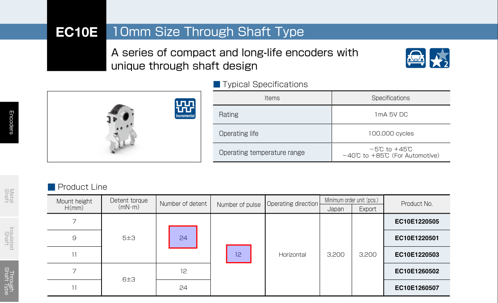
</table>

這樣能理解吧。

<br>

#### 指標設備


<br>

### C. 設備連接設定

韌體核心功能及腳位設定完畢之後，接著要來設定「`MCU`」連接在「裝置」上的設定：
- 藍牙通訊。
- USB通訊。

沒錯，有線及無線都要設置，`zmk` 韌體經過我跟朋友討論過後發現，它少了一個設定，鍵盤就會罷工。

1. 首先回到 `XXX-zmk-config` 資料夾，進入 `boards/shields/<custom_keyboard>` 資料夾目錄：

``` bash
zmk cd
cd boards/shields/<custom_keyboard>
```

2. 然後將 `.conf` 檔案打開，將連接設定寫入後存檔：

``` conf
# 藍牙設定
CONFIG_ZMK_BLE=y
CONFIG_ZMK_KEYBOARD_NAME="<custom_keyboard_BLE>" # 藍牙廣播名稱
CONFIG_BT_CTLR_TX_PWR_PLUS_8=y # 提升藍牙傳輸功率
CONFIG_CLOCK_CONTROL_NRF_K32SRC_RC=y # 使用內部 RC 振盪器
CONFIG_CLOCK_CONTROL_NRF_K32SRC_500PPM=y # RC 振盪器精度設定

# 電池設定
CONFIG_ZMK_BATTERY_REPORTING=n # 關閉電池報告功能

# USB 設定
CONFIG_ZMK_USB=y
```

如果這部分沒有設定好，`MCU` 會裝死給你看，你用其他藍牙設備也搜尋不到訊號，但連接設備的藍色燈光會一直閃爍。

> 特別注意：市面上許多的 `nice!nano v2` 克隆版跟原廠在藍牙晶片發射功率上可能有差異，這點務必先參閱「開發板原理圖」後，再根據 `zmk` 的設定來調整。這裡我就有開啓 `RC` 振盪器的校正功能，才讓我順利地用藍牙設備接受到自己的鍵盤。

3. 然後打開 `.keymap` 檔案，將控制藍牙的按鍵功能設定進 `keymap` 裡面：

``` c
#include <dt-bindings/zmk/outputs.h> // 有使用到 OUT_* 系列的按鈕，參閱官方 Output Selection 文本
... 前略。
        // Layer 3: System/Control
        sys_layer {
            display-name = "System Layer";
            bindings = <
                &bt BT_CLR   &bt BT_SEL 0 &bt BT_SEL 1 &bt BT_SEL 2 &out OUT_BLE &out OUT_USB &none  &none  &kp INS  &kp SLCK &kp PAUSE_BREAK  &kp PSCRN 
                &kp CAPS     &none        &none        &none        &none        &none        &none  &none  &none    &none    &none            &none
                &none        &none        &none        &none        &none        &none        &none  &none  &none    &none    &none            &none
                &none        &none        &none        &none        &none        &none        &none  &none  &none    &none    &none            &to 0      &none
            >;
            // 藍牙設定的按鍵功能可以參閱 zmk 官方的文本進行寫入。
        };
        ...
```

藍牙連接的設備最多可以設定 `5` 組，這裡我只有設定一般市面上常規的 `3` 組連接設定。

<br>
